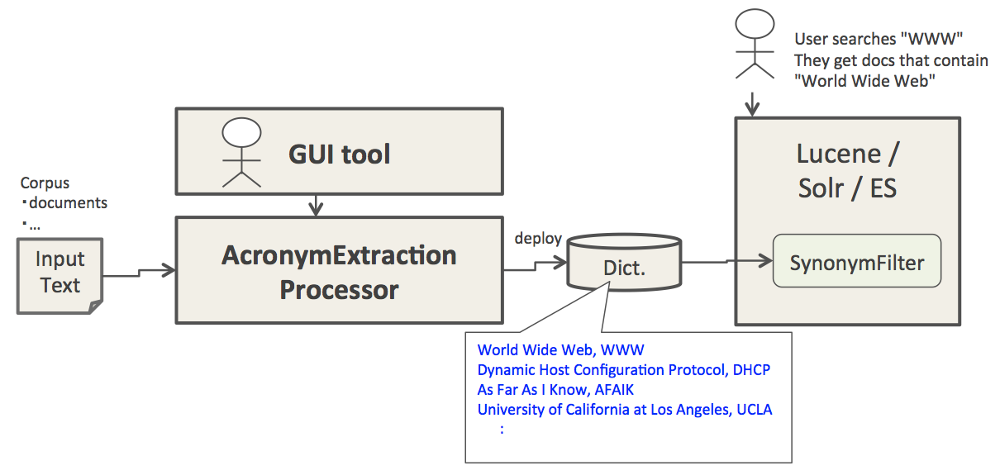

# NLP4L-DICT： 頭文字略語抽出

## 概要

頭文字略語抽出ソリューションは、英語などで書かれた自然言語テキストから頭文字略語（acronym）とその正式名称（expansion）のペアのリストを出力するものです。以下はその出力例です。

```
World Wide Web, WWW
Dynamic Host Configuration Protocol, DHCP
As Far As I Know, AFAIK
University of California at Los Angeles, UCLA
```

NLP4L の頭文字略語抽出は論文[Acrophile: an automated acronym extractor and server](http://dl.acm.org/citation.cfm?id=336664)に紹介されている4つの方法のうち、Simple Canonical の方法を実装したものになります。

### 利用シナリオ

頭文字略語抽出ソリューションを使って頭文字略語（acronym）とその正式名称（expansion）のペアのリストを出力し、出力ファイルを Lucene の SynonymFilter に適用することで再現率の高い検索を行えるようになります。



## サンプルを試してみる (頭文字略語抽出)

NLP4Lの頭文字略語抽出ソリューションを理解するために、付属のサンプルを見てみましょう。

文書分類ソリューションを使用したサンプルのコンフィグレーションファイルが、examplesディレクトリに同梱されていますので、実際に動かして、試してみてください。

|sample|config file|
|:--|:--|
|英語のサンプルテキストから頭文字略語を抽出する設定例|examples/example-acronym.conf|

## Configuration

### class設定

class名には、org.nlp4l.framework.builtin.acronym.AcronymExtractionProcessorFactory と指定します。

以下のコンフィグレーションを参照してください。

```
  processors : [
    {
      class : org.nlp4l.framework.builtin.acronym.AcronymExtractionProcessorFactory
      settings : {
        textField:   "text"
        algorithm:   "simpleCanonical"   // TODO: algorithm parameter is ignored now.
      }
    }
  ]
```

### settings設定

頭文字略語抽出プロセッサーで設定可能なsettingsは、以下の通りです。

|name|required|default|description|
|:--|:--:|:--:|:--|
|textField|true||頭文字略語抽出を行う対象テキストフィールド名を指定します。|
|algorithm|true|simpleCanonical|抽出アルゴリズムを指定します。現在は無視されます。|

### 出力 Dictionary

頭文字略語抽出プロセッサーの結果はacronymsセルに出力されるので、次のように GenericDictionaryAttributeFactory を利用するとよいでしょう。

```
{
  dictionary : [
    {
      class : org.nlp4l.framework.builtin.GenericDictionaryAttributeFactory
      settings : {
        name: "AcronymsResultDict"
        attributes : [
          { name: "acronyms" }
        ]
      }
    }
  ]
}
```
