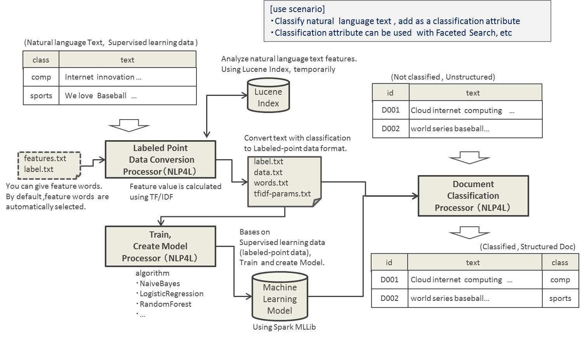
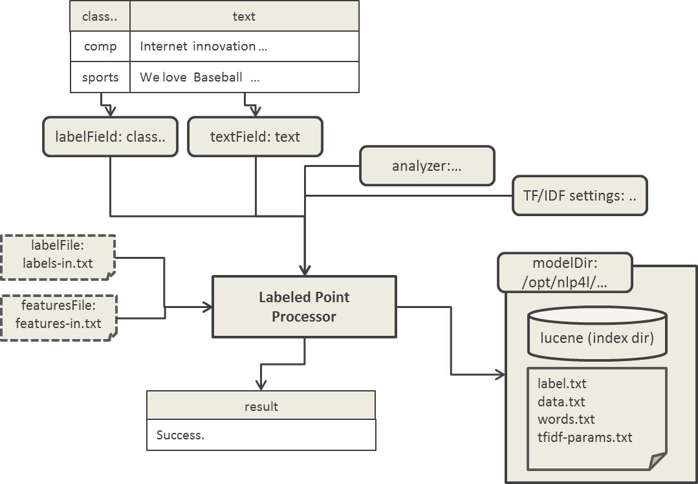
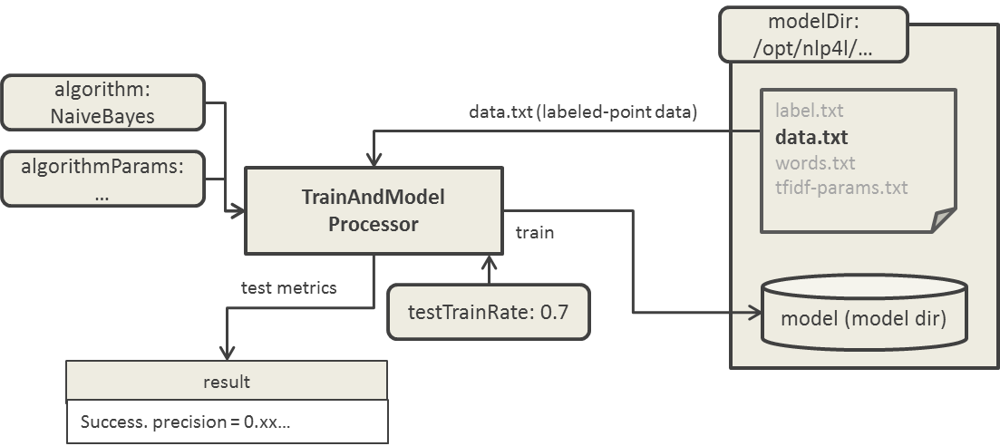
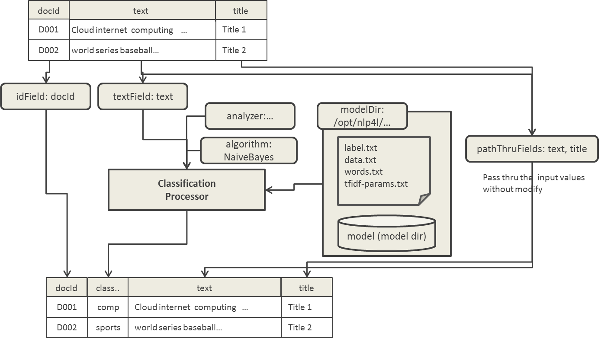

# NLP4L-DICT: Document Classification 


## Overview: 

The document classification solution of NLP4L provides a function to analyze and, based on its feature amount, classify text written in natural language into categories.

Machine Learning Library (MLlib), which is provided by [Apache Spark (http://spark.apache.org/)](http://spark.apache.org/), is used for categorization. The document classification that NLP4L provides is multiclass classification (Multi-Class Classification).

Look at the following diagram. It describes the overview of document classification process and usage scenarios of typical document classification.



Let's look at the diagram in detail.

#### Converting to Labeded-point Data Format
The document classification is supervised learning and, therefore, you need to prepare categorized articles (as many as possible) as its training data.

Calculate TF/IDF value of words from the text in this training data and make it the feature amount, and convert this feature amount data into Labeled-point format data. Words to be features, by default, are automatically extracted from text documents but you can also provide them from external files.
 (Internally, in order to calculate document feature and TF/IDF values, they are temporarily added to Lucene Index to be used.) 

#### Creating Training and Learning Models
Next, import training data that was output as Labeled-point data and put it thorough the machine learning (Training) to create a learning model.

This machine learning uses Apache Spark MLlib and its classification is multiclass classification. The algorithm, by default, is NaiveBayes and you can use LogisticRegression, DecisionTree/RandomForest, and others depending on your settings.

#### Document Classification

Once learning model is created, you can use it to classify uncategorized documents.

To classify documents, you must give TF/IDF information and parameters from calculation source because feature amount must be calculated from these unclassified text documents as well. Apply feature amount of unclassified text to the learning model to classify them.


### Usage Scenario 


You can use the document classification solution to add classification attributes to unstructured document so you will be able to process them as structured documents. This way, refinement search using facets will be available, and useful for [Incremental Precision Improvement](../overview.md#Incremental Precision Improvement).

## Playing with Examples (Document Classification)

Let's look at the included examples to understand the document classification solution of NLP4L,

You can find example configuration file using document classification solution in the examples directory. Play with them in practice.

|sample|config file|
|:--|:--|
|Conversion to Labeded-point Data Format|examples/example-spark-mllib-labeled-point.conf|
|Creating Training/Learning Model|examples/example-spark-mllib-train-model.conf|
| Classification of Document|examples/example-spark-mllib-classification.conf|


## Processors

As you have seen so far, document classification solution is divided into 3 steps with each step provided with respective Processor.

|processor|description|
|:--|:--|
|LabeledPointProcessor|Read training data to calculate feature amount and convert it to Labeled-point data format.|
|TrainAndModelProcessor|Create training/learning model based on the Labeled-point data.|
|ClassificationProcessor|Use learning model to classify unclassified documents.|

Configuration of each Processor is explained in the following.

## Configuration (Document Classification)

## LabeledPointProcessor
### class setting
Specify org.nlp4l.framework.builtin.spark.mllib.LabeledPointProcessorFactory as the class name of LabeledPointProcessor.

### Settings

Settings available for LabeledPointProcessor are as follows.

|name|required|default|description|
|:--|:--:|:--:|:--|
|labelField|true||Specify the classification label field name of training data.<br>Ex: "category"|
|textField|true||Specify the text field name of training data.<br>Ex: "text"|
|modelDir|true||Specify the directory used for data file output and model creation.<br>Ex: "/opt/nlp4l/example-doc-class"|
|analyzer|true||Specify Lucene Analyzer to analyze text field. <br>Ex: {<br>class : org.apache.lucene.analysis.standard.StandardAnalyzer<br>}|
|labelFile|false|-|Specify the classification label file. By default, it is extracted and auto-generated from the classification label field of input data. <br>Ex: <br>"/opt/nlp4l/example-doc-class/label-in.txt"
|featuresFile|false|-|Specify the word file to become the feature. By default, it is extracted and auto-generated from the textField of input data. <br>Ex: <br>"/opt/nlp4l/example-doc-class/features-in.txt"
|maxDFPercent|false|99|TF-IDF Value Calculation Parameter : max document frequency (%)<br>Ex: 99|
|minDF|false|1|TF-IDF Value Calculation Parameter : min document frequency<br>Ex: 1|
|maxFeatures|false|-1|TF-IDF Value Calculation Parameter : max features<br>Ex: -1<br>-When 1 is specified, the all words are extracted as feature words.|
|tfMode|false|n|TF-IDF Value Calculation Parameter : TF mode<br>Ex: "n"<br>tfMode can be set to n/l/m/b/L/w. Refer to computation formula(*1).|
|smthTerm|false|0.4|TF-IDF Value Calculation Parameter : smoothing param<br>Ex: 0.4|
|idfMode|false|t|TF-IDF Value Calculation Parameter : IDF mode<br>Ex: "t"<br>idfMode can be set to n/t/T/p/P. Refer to computation formula(*2).|
|termBoostsFile|false|-|TF-IDF Value Calculation Parameter : term boosts file<br>Ex: "/opt/nlp4l/example-doc-class/termBoosts.txt"

```
(*1) tfMode
n/l/m/b/L/w (default=n)

n: TF
l: 1 + math.log(TF)
m: smthTerm + (smthTerm * TF) / maxTF
b: if (TF > 0) 1.0 else 0.0
L: (1 + math.log(TF)) / (1 + math.log(aveTF))
w: if (TF > 0) 1 + math.log(TF) else 0.0

TF: term freq on the doc.
smthTerm: smthTerm (default=4.0)
aveTF : the average of TF in the document
maxTF : the max term frequency in the whole documents

```

```
(*2) idfMode
n/t/T/p/P (default=t)

n: 1
t: math.log(numDocs / DF)
T: math.log(numDocs+1 / DF+1)
p: math.max(0, math.log((numDocs - DF) / DF))
P: math.max(0, math.log((numDocs+1 - DF+1) / DF+1))

numDocs: total num of documents
DF: document frequency for the term
```


Refer to the following example configuration.

```
{
 processors : [
  {
   class : org.nlp4l.framework.builtin.spark.mllib.LabeledPointProcessorFactory
   settings : {
    labelField: "category"
    textField:  "text"
    modelDir:  "/opt/nlp4l/example-doc-class"
    analyzer : {
     class : org.apache.lucene.analysis.standard.StandardAnalyzer
    }
   }
  }
 ]
}

```

### Output File and Dictionary

As an execution result, LabeledPointProcessor outputs Dictionary that only includes the successful text message ("success" is displayed).



Also, as another execution result, following files are output to the directory that is specified by modelDir in settings.

|file|description|
|:--|:--|
|data.txt|Labeled-point data file. (LibSVM Format)|
|label.txt|Classification label file. Information regarding label index value (starts from 0) and label name.|
|words.txt| Feature word file. Information regarding the words which the feature amount was calculated from. |tfidf-params.txt|Information regarding the parameter used to calculate TF/IDF value. |
|lucene|Temporarily created Lucene index directory. (Unused in later document classification processes.)|


## TrainAndModelProcessor
### Class Setting
Specify org.nlp4l.framework.builtin.spark.mllib.TrainAndModelProcessorFactory to the class name of TrainAndModelProcessor.

### Settings

Settings available for TrainAndModelProcessor are as follows.

|name|required|default|description|
|:--|:--:|:--:|:--|
|modelDir|true||Specify the directory to be used to create models. <br>Ex: "/opt/nlp4l/example-doc-class"|
|algorithm|false|NaiveBayes|Specify the algorithm. Algorithms available are as follows. <br>- NaiveBayes<br>- LogisticRegressionWithLBFGS<br>- DecisionTree<br>- RandomForest<br>Ex: "NaiveBayes"|
|algorithmParams|false|-|Specify a parameter to pass to the algorithm. <br>Ex: {<br>lambda: 1.0<br>modelType: "multinomial"<br>}|
|trainTestRate|false|0.7|Specify the percentage of the input data used for Training. The remaining data will be used for testing. When 0.7 is specified, 70% of the data is used for training while 30% of the data is used for testing created learning model in order to measure its performance. <br>Ex: 0.7|


Refer to the following example configuration.
```
{
 processors : [
  {
   class : org.nlp4l.framework.builtin.spark.mllib.TrainAndModelProcessorFactory
   settings : {
    modelDir:   "/opt/nlp4l/example-doc-class"
    algorithm:  "NaiveBayes"
    trainTestRate: 0.7
   }
  }
 ]
}

```

### Output File and Dictionary


As an execution result, TrainAndModelProcessor outputs Dictionary that only includes a successful text message to indicate the completion of process.
The result text message also includes the resulting measurement of test process that uses learning models metrics information (displays "precision = 0.xx...").

Also, as another execution result, a learning model file (directory) is created in the directory specified by modelDir of Settings.




## ClassificationProcessor
### Class Setting
Specify org.nlp4l.framework.builtin.spark.mllib.ClassificationProcessorFactory as the class name of ClassificationProcessor.

### Settings

Settings available for the ClassificationProcessor are as follows.

|name|required|default|description|
|:--|:--:|:--:|:--|
|modelDir|true||Specify the directory where learning models are located.<br>Ex: <br>"/opt/nlp4l/example-doc-class"|
|textField|true||Specify the text field name to classify.<br>Ex: "text"|
|idField|true|| Specify the document ID field name to classify.<br>Ex: "docId"|
|algorithm|false|NaiveBayes|Specify an algorithm. Available algorithms are as follows. You must specify the same algorithm you used to create a model. <br>- NaiveBayes<br>- LogisticRegressionWithLBFGS<br>- DecisionTree<br>- RandomForest<br>Ex: "NaiveBayes"|
|analyzer|true||Specify Analyzer to analyze text fields.<br>Ex: {<br>class : org.apache.lucene.analysis.standard.StandardAnalyzer<br>}|
|passThruFields|false| - |Specify the name of field which value in input document you want to output without any change. You can specify document title, text field, and etc. Define in the array format because you can specify more than one field. <br>Ex:["title", "text"]

Refer to the following example configuration.

```
{
 processors : [
  {
   class : org.nlp4l.framework.builtin.spark.mllib.ClassificationProcessorFactory
   settings : {
    textField:   "text"
    idField:    "docId"
    passThruFields: [ "title", "text" ]
    modelDir:   "/opt/nlp4l/example-doc-class"
    algorithm:  "NaiveBayes"
    analyzer : {
     class : org.apache.lucene.analysis.standard.StandardAnalyzer
    }
   }
  }
 ]
}

```

### OutputDictionary

The Dictionary, which is output as an execution result of ClassificationProcessor, will be as follows depending on your settings.

- idField(docId) is required item and will be an output item without any change.
- The label name obtained from the classification of field specified by textField(text) will be output to the "classification" field.
- Specifying passThruFields(text, title) will output a value as an output item without any change.




