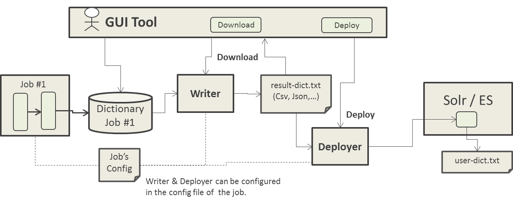
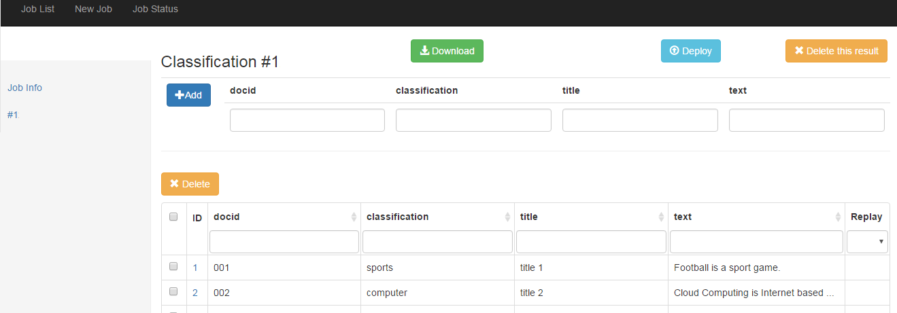

# NLP4L-DICT： 辞書のダウンロードとデプロイ


## 概要

NLP4Lの辞書生成統合ツールでは、生成された辞書データをファイル出力してダウンロードする機能が提供されています。また、サーバへ直接デプロイする仕組みも提供されています。

このダウンロードとデプロイ機能を有効にするには、ダウンロードしたいJobのConfigファイルに設定する必要があります。

生成された辞書データをファイル出力するには、Writerと呼ばれる辞書データをファイル出力するコンポーネント（標準ではJsonファイル形式とCSVファイル形式へ出力するWriterが提供されている）を設定します。また、サーバへ直接デプロイしたい場合には、Deployerと呼ばれるコンポーネントを設定します。Deployする必要が無いない場合、Writerの設定だけでも大丈夫です。WriterとDeployerの設定に関しては、後述します。




Writerの設定を行うと、GUIツールにDownloadボタンが表示されます。Downloadボタンを押下すると、Writerが実行され、Writerが出力したファイルをブラウザよりダウンロードできます。

また、Deployerの設定を行うと、Deployボタンが表示されるようになります。Deployボタンを押下すると、まず、Writerが実行され、その後、Writerが出力したファイルを、Deployerが処理します。




## Writer

辞書データをファイル出力するには、Writerの設定を行います。

標準では、Jsonファイル形式とCSVファイル形式へ出力するWriterが提供されています。

### JsonFileWriterの設定
以下のコンフィグレーション例を参考にしてください。
```
{
  processors : [
    {
      class : ...
      settings : ...
    }
  ]
  writer : {
    class : org.nlp4l.framework.builtin.JsonFileWriterFactory
    settings : {
      file : "/tmp/nlp4l-ner-dict.json"
    }
  }
}

```
JsonFileWriterで設定可能なsettingsは、以下の通りです。

|name|required|default|description|
|:--|:--:|:--:|:--|
|file|false||Writerの出力先ファイル。<br>省略すると、システムのテンポラリーディレクトリにファイルが自動生成されます。<br>例: "/tmp/result-dict.json"|

### CSVFileWriterの設定
以下のコンフィグレーション例を参考にしてください。
```
{
  processors : [
    {
      class : ...
      settings : ...
    }
  ]
  writer : {
    class : org.nlp4l.framework.builtin.CSVFileWriterFactory
    settings : {
      file : "/tmp/nlp4l-doc-clss-dict.csv"
      separator : ","
      encoding :  "UTF-8"
    }
  }
}

```
CSVFileWriterで設定可能なsettingsは、以下の通りです。

|name|required|default|description|
|:--|:--:|:--:|:--|
|file|false||Writerの出力先ファイル。<br>省略すると、システムのテンポラリーディレクトリにファイルが自動生成されます。<br>例: "/tmp/result-dict.csv"|
|separator|false|","(カンマ)|区切り文字。<br>例："," や "&#124;" など|
|encoding|false|UTF-8|出力ファイルの文字コード<br>例："UTF-8"|

## Deployer

Writerにより出力されたファイルをデプロイするには、Deployerの設定を行います。

標準では、HTTPファイル送信するDeployerが提供されています。

### HttpFileTransferDeployerの設定
以下のコンフィグレーション例を参考にしてください。
```
{
  processors : [
    {
      class : ...
      settings : ...
    }
  ]
  writer : {
    class : org.nlp4l.framework.builtin.CSVFileWriterFactory
    settings : {
      file : "/tmp/nlp4l-doc-clss-dict.csv"
      separator : ","
      encoding :  "UTF-8"
    }
  }
  deployer : {
    class : org.nlp4l.framework.builtin.HttpFileTransferDeployerFactory
    settings : {
      deployToUrl :  "http://localhost:8983/FileReceiverServlet"
      deployToFile : "/opt/solr/nlp4l/doc-class-dict.csv"
    }
  }
}

```
HttpFileTransferDeployerで設定可能なsettingsは、以下の通りです。

|name|required|default|description|
|:--|:--:|:--:|:--|
|deployToUrl|true||デプロイ先のURL。<br>例: "http://localhost:8983/FileReceiverServlet"|
|deployToFile|true||保存先のファイル名。<br>例: "/opt/solr/nlp4l/doc-class-dict.csv"|

HttpFileTransferDeployerを使用する場合、別途、受け口となるサーバ側での設定（Servletなど）が必要です。


以上

