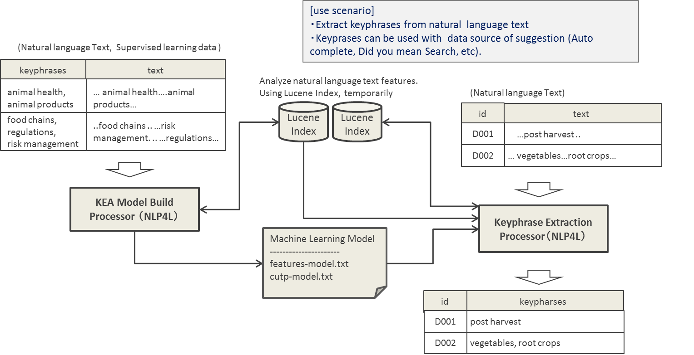
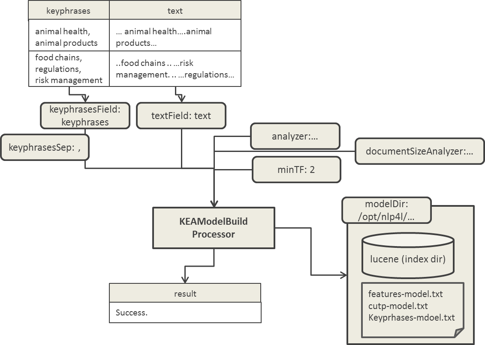
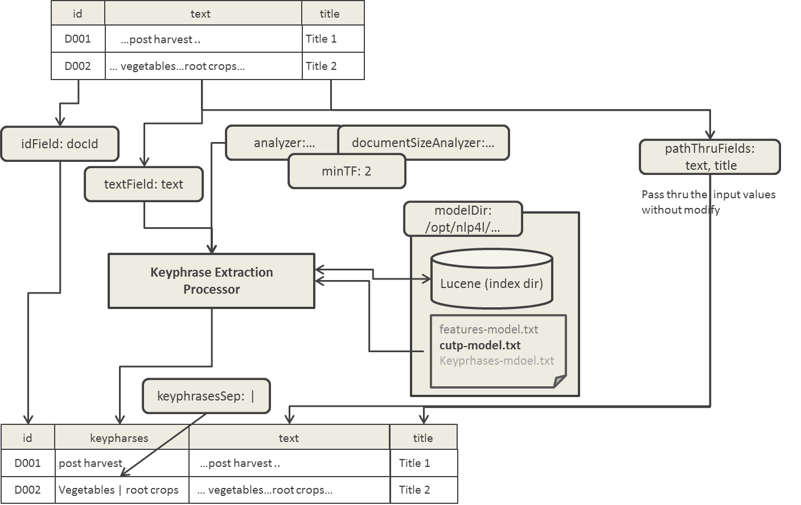

# NLP4L-DICT： キーフレーズ抽出


## 概要

NLP4Lのキーフレーズ抽出ソリューションは、自然言語で書かれたテキストからキーフレーズ（キーワード）を抽出する機能を提供します。

抽出されるキーフレーズは、1つから最大3つの連続する単語(1-Gram、2-Gram、および、3-Gram)を対象としています。

キーフレーズ抽出は、KEAアルゴリズムに基づいて実現されています。[KEA](http://www.nzdl.org/Kea/)は、ニュージーランドのワイカト大学で開発された、自然言語で書かれた文書からキーフレーズ（キーワード）を自動抽出するプログラムです。KEAはKeyphrase Extraction Algorithmの略であり、KEAプログラムを構成するアルゴリズムそのものを指す場合もあります。

下記の図をご覧ください。ここではキーフレーズ抽出の処理概要と利用シナリオが描かれています。



もう少し詳しく見ていきましょう。

#### 学習モデルの作成

キーフレーズ抽出は教師あり学習となります。そのため、文書とそこから抽出されたキーフレーズのペアを教師データとして用意します。

#### キーフレーズの抽出

学習モデルを作成したら、未知の文書を入力してキーフレーズ抽出を行います。

（テキスト解析と単語の統計量の取得のために、文書は一時的にLuceneのIndexに登録しています。）


### 利用シナリオ

手持ちのコーパスからキーフレーズを抽出することができるので、それぞれのユーザの業務ドメインに特化した専門用語が入手できます。したがって、キーワードサジェスチョン（オートコンプリート）やもしかして検索のデータソースとして用いると、ユーザの検索エクスペリエンスの向上に役立つでしょう。
また、抽出できる文字列は「1単語以上からなるフレーズ」なので、単なる単語のサジェスチョンよりもスマートな印象をユーザに与えることができます。

## サンプルを試してみる (キーフレーズ抽出)

NLP4Lのキーフレーズ抽出ソリューションを理解するために、付属のサンプルを見てみましょう。

キーフレーズ抽出ソリューションを使用したサンプルのコンフィグレーションファイルが、examplesディレクトリに同梱されていますので、実際に動かして、試してみてください。

|sample|config file|
|:--|:--|
|学習モデルの作成|examples/example-kea-model.conf|
|キーフレーズの抽出|examples/example-kea-extract.conf|


## Processors

これまで見てきたように、キーフレーズ抽出ソリューションでは、2つのステップに処理が分かれており、それぞれに対応するProcessorが提供されています。

|processor|description|
|:--|:--|
|KEAModelBuildProcessor|教師データに基づいて、学習モデルの作成を行う。|
|KeyphraseExtractionProcessor|作成した学習モデルを用いて、未知文書からキーフレーズ抽出を行う。|

以下では、それぞれのProcessorのConfigurationを説明します。

## Configuration (文書分類)

## KEAModelBuildProcessor

### class設定

KEAModelBuildProcessorのclass名には、org.nlp4l.framework.builtin.kea.KEAModelBuildProcessorFactory と指定します。

### settings設定

KEAModelBuildProcessorで設定可能なsettingsは、以下の通りです。

|name|required|default|description|
|:--|:--:|:--:|:--|
|keyphrasesField|true||抽出したキーフレーズを出力するフィールド名を指定します。<br>例: "keyphrases"|
|keyphrasesSep|false|","(カンマ)|キーフレーズが複数出力する場合の区切り文字を指定します。<br>例："," や "&#124;" など|
|textField|true||キーフレーズ抽出を行う対象のテキストフィールド名を指定します。<br>例: "text"|
|modelDir|true||モデル作成に使用されるディレクトリを指定します。<br>例: "/opt/nlp4l/example-kea-class"|
|analyzer|false|-|テキストフィールドを分析するための、Analyzerを指定します。<br>例:  {<br>class : org.nlp4l.framework.builtin.kea.KEAStandardAnalyzer<br>}|
|documentSizeAnalyzer|false|-|文書サイズを分析するための、Analyzerを指定します。<br>例:  {<br>tokenizer { factory : whitespace }<br>}|
|minTF|false|2|最少単語(フレーズ)出現回数を指定します。<br>例: 2|


以下のコンフィグレーション例を参考にしてください。
```
{
  processors : [
    {
      class : org.nlp4l.framework.builtin.kea.KEAModelBuildProcessorFactory
      settings : {
        keyphrasesField:  "keyphrases"
        textField:        "text"
        modelDir:         "/opt/nlp4l/example-kea"
      }
    }
  ]
}

```

### 出力ファイルと Dictionary

KEAModelBuildProcessorの実行結果として出力されるDictionaryは、実行終了を告げるテキストのみ("success"と表示)です。



また、実行結果として、settings設定のmodelDirで指定したディレクトリに、以下のファイルが出力されます。

|file|description|
|:--|:--|
|features-model.txt|特徴量の実数値の学習モデルファイル。|
|cupt-model.txt|特徴量をMDLP（最小記述長原理）により求めた離散値のデータ。|
|keyphrases-model.txt|モデル作成に使用したキーフレーズの特徴データ情報(主にデバッグ用)。
|lucene-inex-model|テキスト解析用に作成したLuceneのindexディレクトリ。|


## KeyphraseExtractionProcessor
### class設定
KeyphraseExtractionProcessorのclass名には、org.nlp4l.framework.builtin.spark.mllib.KeyphraseExtractionProcessorFactory と指定します。

### settings設定

KeyphraseExtractionProcessorで設定可能なsettingsは、以下の通りです。

|name|required|default|description|
|:--|:--:|:--:|:--|
|idField|true||入力文書の文書IDフィールド名を指定します。<br>例: "docId"|
|textField|true||キーフレーズ抽出の対象となる、入力文書のテキストフィールド名を指定します。<br>例: "text"|
|modelDir|true||学習モデルを配置したディレクトリを指定します。<br>例: <br>"/opt/nlp4l/example-kea"|
|keyphrasesSep|false|","(カンマ)|キーフレーズが複数存在する場合の区切り文字を指定します。<br>例："," や "&#124;" など|
|passThruFields|false| - |入力データの値をそのまま出力する場合に指定します。文書のタイトルやテキストフィールドなどを指定できます。複数のフィールドを指定可能なため、配列形式で定義します。<br>例:["title", "text"]
|maxKeyphrases|false|20|抽出されるキーフレーズの最大数。<br>例: 20|
|scoreThreshold|false|0.0|抽出されるキーフレーズのスコアの最低ライン。このスコア以上のキーフレーズが抽出されます。<br>例: 0.5|
|incrementDfDocNum|false|true|DF(document freq)と総ドキュメント数に、未知文書分として、1を加算してからTF/IDF計算するか否か。<br>例: true|
|nGramPriorityOrder|false|3,2,1|Nグラムの優先順を指定します。スコアとTF/IDF値が同じ場合、ここで指定したNグラム優先順が使用されます。<br>例: 3,2,1|
|analyzer|false|-|テキストフィールドを分析するための、Analyzerを指定します。<br>例:  {<br>class : org.nlp4l.framework.builtin.kea.KEAStandardAnalyzer<br>}|
|documentSizeAnalyzer|false|-|文書サイズを分析するための、Analyzerを指定します。<br>例:  {<br>tokenizer { factory : whitespace }<br>}|
|minTF|false|2|最少単語(フレーズ)出現回数を指定します。<br>例: 2|


以下のコンフィグレーション例を参考にしてください。
```
{
  processors : [
    {
      class : org.nlp4l.framework.builtin.kea.KeyphraseExtractionProcessorFactory
      settings : {
        idField:     "docId"
        textField:   "text"
        modelDir:    "/opt/nlp4l/example-kea"
        passThruFields: [
          "text"
        ]
      }
    }
  ]
}

```

### 出力 Dictionary

KeyphraseExtractionProcessorの実行結果として出力されるDictionaryは、settings設定により、以下のようになります。

- idField(docId)は、必須項目で、そのまま出力項目となります。
- textField(text)で指定したフィールドから抽出されたキーフレーズが、"keyphrases"フィールドに出力されます。キーフレーズが複数の場合、keyphrasesSep(デフォルトは",")で指定した値が区切り文字として使用されます。
- passThruFields(text, title)を指定すると、そのままの値が、出力項目として、出力されます。




