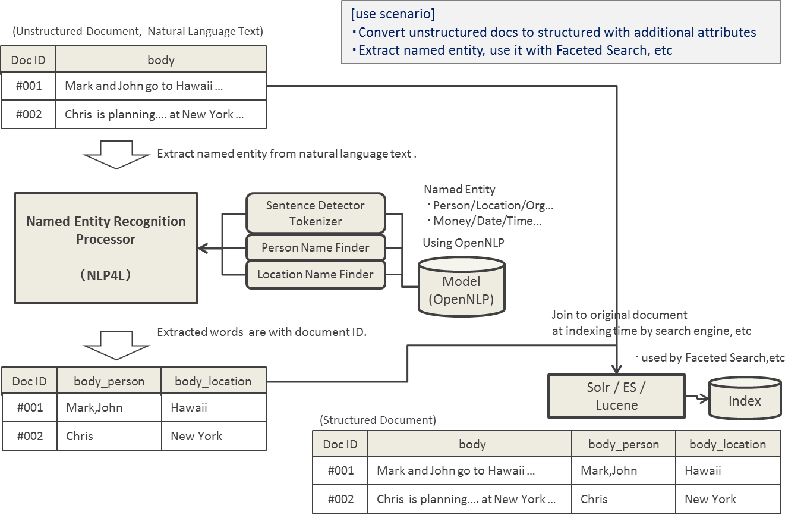
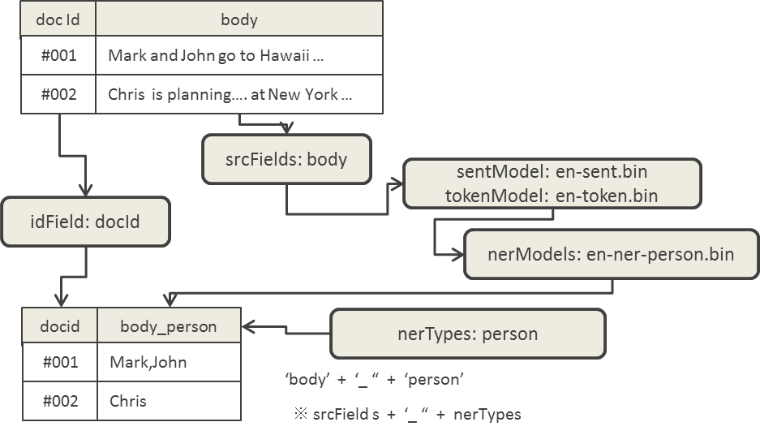
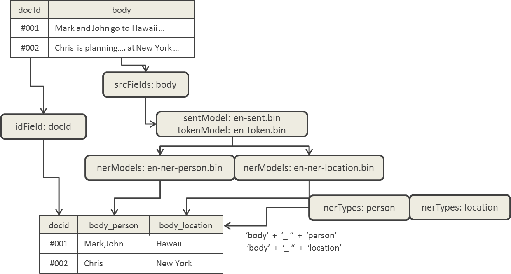
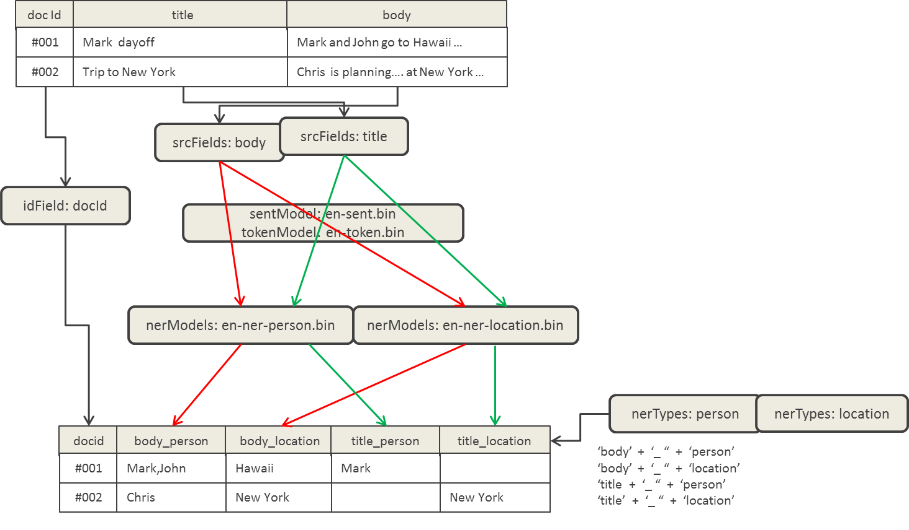
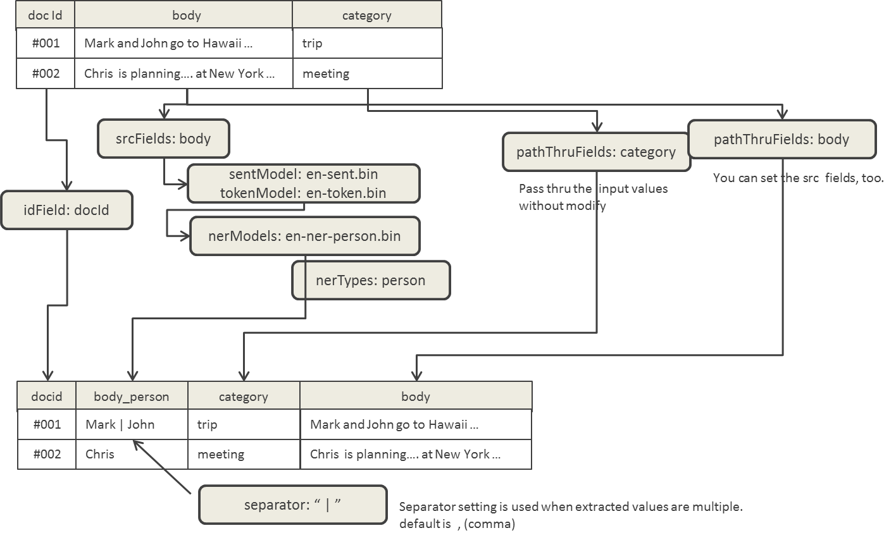

# NLP4L-DICT： 固有表現抽出


## 概要

NLP4Lの提供する固有表現抽出ソリューションは、自然言語で書かれたテキストから固有表現(人名、場所、組織、金額、日付、時間など)を切り出す機能を提供します。

固有表現の抽出は、[Apache OpenNLP (http://opennlp.apache.org/)](http://opennlp.apache.org/)で提供されているName Finderの学習済みモデルを使用することにより、実現されています。

### 利用シナリオ

固有表現抽出ソリューションを利用することで、自然言語で書かれた非構造の文書に対し、固有表現の属性を追加することにより、構造化文書として扱えるようになります。これによりファセットを使った絞り込み検索を活用できるようになります。

下図では、抽出した固有表現を当該文書IDに関連づけ、検索エンジンのインデックス作成時に元の文書と結合する利用シナリオを想定しています。



## サンプルを試してみる(固有表現抽出)

NLP4Lの提供する固有表現抽出ソリューションの理解を進めるには、付属のサンプルを見てみるのが近道でしょう。

固有表現抽出を使用したチュートリアルが、Getting Startedに記載されています。固有表現抽出のサンプルに関しては、そちらをご参照ください。

- Getting Started ([日本語](../getting_started_ja.md)／[English](../getting_started.md))

## Configuration (固有表現抽出)

### class設定
固有表現抽出は、各入力レコード毎に処理されるため、Record Processorとして設定する必要があります。
class名には、org.nlp4l.framework.builtin.ner.OpenNLPNerRecordProcessorFactory と指定します。


以下のコンフィグレーションを参照してください。

```
{
  processors : [
    {
      class : org.nlp4l.framework.processors.WrapProcessor
      recordProcessors : [
        {
          class : org.nlp4l.framework.builtin.ner.OpenNLPNerRecordProcessorFactory
          settings : {
            ...
          }
        }
      ]
    }
  ]
}
```

### settings設定

固有表現抽出プロセッサーで設定可能なsettingsは、以下の通りです。

|name|required|default|description|
|:--|:--:|:--:|:--|
|sentModel|true||OpenNLPのSentence Detectorのモデルファイルを指定します。<br>例: "/opt/nlp4l/example-ner/models/en-sent.bin"|
|tokenModel|true||OpenNLPのTokenizerのモデルファイルを指定します。<br>例: "/opt/nlp4l/example-ner/models/en-token.bin"|
|nerModels|true||OpenNLPのName Finderのモデルファイルを指定します。複数のモデルファイルを指定可能なため、配列形式で定義します。<br>例: [<br>"/opt/nlp4l/example-ner/models/en-ner-person.bin",<br>"/opt/nlp4l/example-ner/models/en-ner-location.bin"<br>]
|nerTypes|true||固有表現のタイプ(人名、場所、金額など)を指定します。ここで指定した値は、出力データのCell名(列名)に使用されます。複数の固有表現タイプを指定可能なため、配列形式で定義します。<br>例: [<br>"person",<br>"location"<br>]
|srcFields|true||固有表現抽出の元となる入力データのフィールド名を指定します。複数のフィールドを指定可能なため、配列形式で定義します。<br>例: [<br>"body",<br>"title"<br>]
|idField|true||入力データの文書IDのフィールド名を指定します。<br>例: docId|
|passThruFields|false| - |入力データの値をそのまま出力する場合に指定します。文書のタイトルや分類などの属性、また、固有表現抽出の元となるフィールドでも指定できます。複数のフィールドを指定可能なため、配列形式で定義します。<br>例: [<br>"category",<br>"title",<br>"body"<br>]
|separator|false|","(カンマ)|抽出した固有表現が複数存在する場合の区切り文字<br>例："," や "&#124;" など|


以下のコンフィグレーション例を参考にしてください。

```
{
  processors : [
    {
      class : org.nlp4l.framework.processors.WrapProcessor
      recordProcessors : [
        {
          class : org.nlp4l.framework.builtin.ner.OpenNLPNerRecordProcessorFactory
          settings : {
            sentModel:  "/opt/nlp4l/example-ner/models/en-sent.bin"
            tokenModel: "/opt/nlp4l/example-ner/models/en-token.bin"
            nerModels: [
              "/opt/nlp4l/example-ner/models/en-ner-person.bin",
              "/opt/nlp4l/example-ner/models/en-ner-location.bin"
              ]
            nerTypes: [
              "person",
              "location"
            ]
            srcFields: [
              "body",
              "title"
            ]
            idField:    "docId"
            passThruFields: [
              "category",
              "title",
              "body"
            ]
            separator:  "|"
          }
        }
      ]
    }
  ]
}

```

### 出力Dictionary

固有表現抽出プロセッサーの実行結果として出力されるDictionaryは、settings設定により、以下のようになります。

#### 基本的なsettingsの場合

まず最初に、固有表現抽出の元となるsrcFieldsが１つ、固有表現抽出用のnerModels(モデルファイル)が1つの場合を見てみましょう。

出力されるDictionaryは、以下の図のようになります。

- idField(docId)は、必須項目で、そのまま出力項目となります。
- srcFields(body)で指定したフィールド名と、nerTypes(person)で指定したタイプ名をアンダースコア(_)で連結した文字列(body_person)が、抽出された固有表現の出力項目となります。

nerModelsは、あくまでモデルファイルを指定するもので、出力項目の名前には使用されません。出力項目の名前として使用されるのは、nerTypesの設定です。




#### モデルを複数指定した場合

次に、モデルファイルを複数指定した場合を見てみましょう。

- srcFields(body)で指定したフィールド名と、nerTypes(personとlocation)で指定したタイプ名をアンダースコア(_)で連結した文字列(body_personとbody_location)が、抽出された固有表現の出力項目となります。



#### 抽出元のフィールドを複数指定した場合

さらに、抽出元のフィールドを複数指定した場合を見てみましょう。

- srcFields(bodyとtitle)で指定したフィールド名と、nerTypes(personとlocation)で指定したタイプ名をアンダースコア(_)で連結した文字列(body_person,body_location,title_person,title_locationの順)が、抽出された固有表現の出力項目となります。




#### その他

最後に、その他のsettingsと出力Dictionaryを見てみましょう。

- 抽出した固有表現値が複数ある場合、settingsで指定した区切り文字(separator)が使用されて出力されます。デフォルトでは、カンマ(,)が使用されます。
- pathThruFieldsを指定すると、元のフィールド値をそのまま加工せず出力することが出来ます。固有表現抽出元のsrcフィールド値も指定することが可能で、そのまま加工されずに出力されます。



