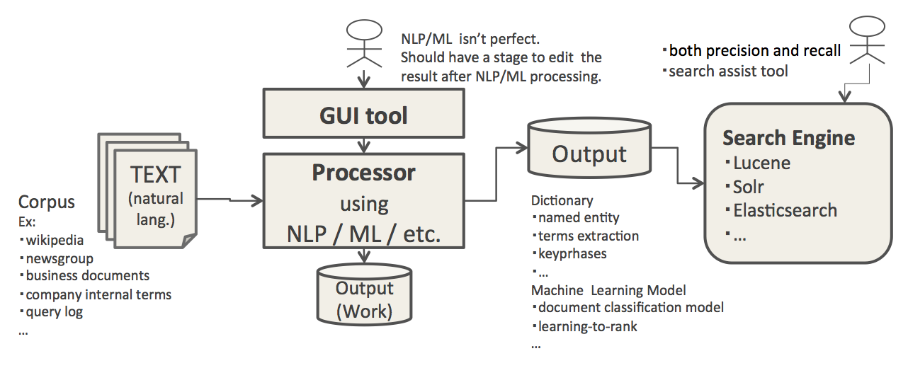
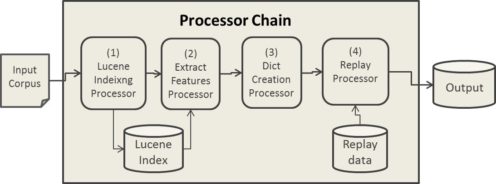
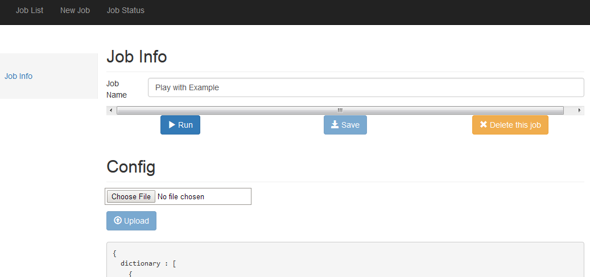
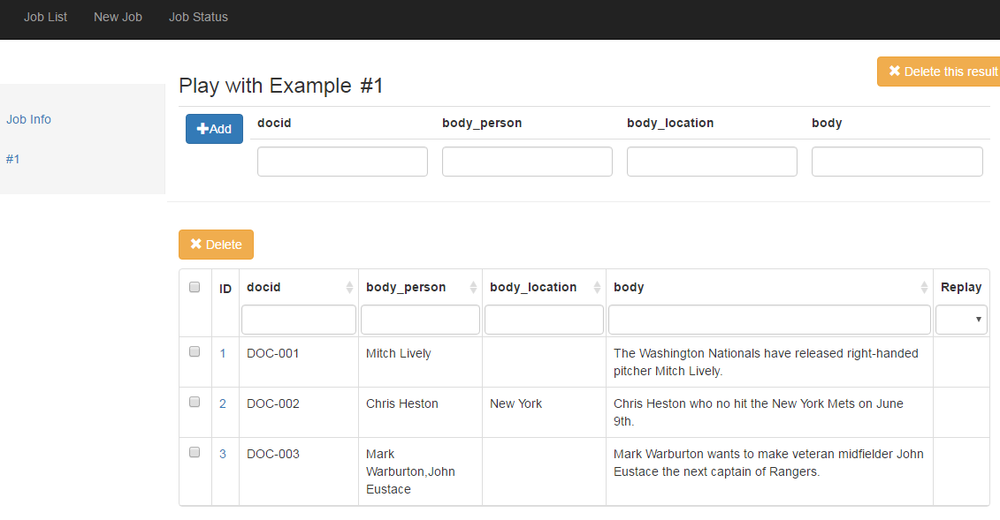

# NLP4L-DICT 辞書生成統合ツール

## コンセプト

NLP4Lでは「検索をよりよいものにする」ためツールとして、辞書生成統合ツールを提供しています。

辞書生成統合ツールでは、インプットとなるコーパス(言語データ)に対し、自然言語処理(NLP)や機械学習(ML)などを用いて処理を行い、アウトプットを検索エンジンで利用することを想定しています。

辞書生成統合ツールの提供するGUIツールでは、これらのコンフィグレーションや実行・操作を行うことが出来ます。また、NLP4Lでは、NLP/ML は完璧ではない、という前提に立っているため、自動生成した辞書などを人間がメンテナンスするGUIも提供されています。

## アーキテクチャー

辞書生成統合ツールのアーキテクチャ図をご覧ください。

### Input
インプットとなるのは、各種コーパスです。一般的には、何らかのテキスト文書ですが、クエリーログなどもインプットになります。

- テキスト文書
    - ウィキペディアなどの用語解説
    - 各種ニュースコーパス(ニュース配信やnewsgroupなど)
    - 企業内文書
    - 企業内用語集
- その他
	- クエリーログ（実際にユーザが検索を行った際の入力キーワード）

### Output
アウトプットとなるのは、各種の辞書データです。また、後の検索エンジンでの実行時に処理を行う場合などでは、機械学習モデルであったりします。

- 辞書データ
	- 固有表現(人名、場所、組織、金額、日付、時間など)
	- 文書分類カテゴリ
	- キーフレーズ
	- 類義語
	- 略語
	- 共起語
	- 専門用語
- 機械学習モデル
	- 文書分類モデル
	- 固有表現モデル
	- キーフレーズモデル

### Processor
辞書生成統合ツールでは、個々の処理をProcessorという単位で実現しています。一連の処理を１つのJobとして実行するために、複数のProcessorを組み合わて実行するように、コンフィグレーションすることができます。

下図の例では、インプットとなるコーパスに対して、

1. まずテキスト解析用にLuceneのインデックスに登録し、
2. インデックスから単語特徴を抽出し、
3. 抽出した特徴を元に辞書データとして生成し、
4. 生成した辞書に、前回メンテナンスした内容を反映(リプレイ処理)

した結果をアウトプットする一連の処理の流れを表しています。

### GUI Tool
GUIツールでは、処理を行うためのコンフィグレーションや実行・操作を行います。また、生成された辞書データをメンテナンスするGUIも提供されています。

- コンフィグレーション、実行操作
    - JOBの登録、設定
    - JOBの実行、状況確認

- 辞書データメンテナンス
    - 生成された辞書データ(JOBの実行結果)の閲覧
    - 辞書データの修正

以下のスクリーンショットは、GUIツールのJob登録画面です。Processorを使用したJobの処理内容は、コンフィグレーションファイルに設定し、アップロードします。

以下のスクリーンショットは、生成された辞書データのメンテナンス画面です。この画面を通じて、人間がデータのメンテナンスを行うことが出来るようになっています。一度メンテナンスしたデータは記憶され、Jobを再実行した際に自動適用する機能(リプレイ機能)も備わっています。

これらのGUIツールを使用したチュートリアルが、[Getting Started](../getting_started_ja.md)に用意されています。実際に、動かして、試して見てください。

## 標準提供のソリューション

NLP4Lでは、標準提供の辞書生成ソリューションとして、以下のものが提供されています。
これらのソリューションは、予め実装されたビルトインProcessorとして提供されています。

|solution|point|contents|
|:--|:--:|:--|
|固有表現抽出|精度|固有表現(人名、場所、組織、金額、日付、時間など)を抽出|
|文書分類|精度|テキスト文書を分類|
|キーフレーズ抽出|精度|キーフレーズを抽出|
|頭文字略語抽出|再現率|Acronym(頭文字略語)を抽出|
|クエリログ取込|その他|実際にユーザが入力したキーワードやフレーズを取り出す|

これらの標準提供ソシューションに関しては、 [NLP4L-DICT User's Guide](dict_users_guide_ja.md)を参照してください。

## ユーザ開発のProcessor

NLP4Lでは、ビルトインのProcessorだけでなく、ユーザがProcessorを開発することも想定しています。

詳しくは、[Programming Guide](dict/dict_programming_guide_ja.md)を参照してください。

