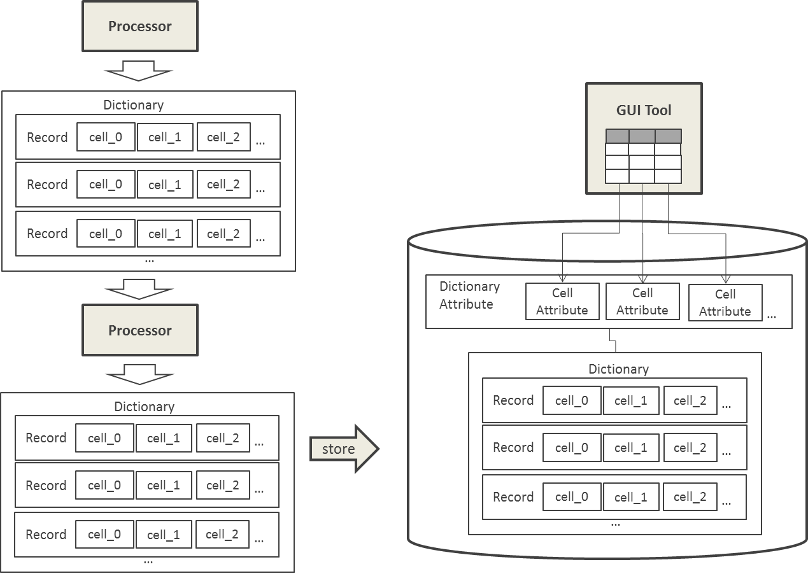

# NLP4L-DICT: Programmer's Guide


## Overview

The Dictionary Creation Integration Tool of NLP4L not only uses built-in standard components but also enables users to program their own components.

Let's look at the information for developers.


## Library for Development

In addition to the Dictionary Creation Integration Tool library set, NLP4L provides a library that has necessary modules picked out for developers.

Refer to the following setting examples to use the library.
 (Assume the version of library is nlp4l-framework-library_2.11-0.4.0 in the following examples.) 

SBT Setting Examples
```
libraryDependencies += "org.nlp4l" % "nlp4l-framework-library_2.11" % "0.4.0"
```
Ivy Setting Examples
```
<dependency org="org.nlp4l" name="nlp4l-framework-library_2.11" rev="0.4.0"/>
```
Maven Setting Examples
```
<dependency>
  <groupId>org.nlp4l</groupId>
  <artifactId>nlp4l-framework-library_2.11</artifactId>
  <version>0.4.0</version>
</dependency>
```


## API Docs

Refer to the API documents in the following.

* API Docs: http://nlp4l.github.io/

## Overview of Data Models

Now, here is the overview of data models used in the Dictionary Creation Integration Tool.

- The Dictionary data will be Input/output data for Processors.
- The Dictionary data can hold more than one Records.
- In addition, Records can hold values in more than one named holder called Cell.

When created, Dictionaries are saved in database and become available for browsing and modification by the GUI tool.
You can use DictionaryAttribute and CellAttribute here. Th attributes including Cell name/type of the created Dictionary must be defined.




## User Developed Processors

Here is how you can implement your own Processors.

### Implementing ProcessorFactory 

To use Processor, you need ProcessorFactory - a Factory class that generates Processors.

- Create a class that inherited ProcessorFactory and implement the getInstance function. 
- You have to obtain a parameter from the settings as needed because the settings (Config class) you set in Configuration is passed as an argument
- Instantiate the Processor class.

```
import com.typesafe.config.Config
import org.nlp4l.framework.processors._
import org.nlp4l.framework.models._

class SimpleProcessorFactory(settings: Config) extends ProcessorFactory(settings) {

 override def getInstance: Processor = {
  new SimpleProcessor(getStrParam("param1", "0001"), getIntParam("param2", 2))
 }
}
```

### Implementing Processor

Next, you need to implement Processor that does the actual processing (Processor is instantiated by the preceding ProcessorFactory).

- Create the class that inherited the Processor and implement the execute function.
- Receive the Dictionary data passed to as an argument of the execute function and implement the process.
- Create the output Dictionary data and return it as the return value of execute method.


```
class SimpleProcessor(val param1: String, val param2: Int) extends Processor {

 override def execute(data: Option[Dictionary]): Option[Dictionary] = {
  Thread.sleep(5000)
  val rcrd01 = Record(Seq(Cell("cell01", param1),Cell("cell02", param2),
              Cell("cell03", 3.1), Cell("cell02_check", null),
              Cell("cell04", null)))
  val rcrd02 = Record(Seq(Cell("cell01", param1), Cell("cell02", null),
              Cell("cell03", null), Cell("cell02_check", null),
              Cell("cell04", null)))
  data match {
   case Some(dic) => {
    val ss = dic.recordList.toBuffer
    ss += rcrd01
    Some(Dictionary(ss))
   }
   case None => {
    val ss = ListBuffer(rcrd01, rcrd02)
    (1 to 20).toList.foreach { n=>
     val rcrd = Record(Seq(Cell("cell01", n.toString()), Cell("cell02", n),
                Cell("cell03", n.toDouble), Cell("cell02_check", null),
                Cell("cell04", n.toFloat)))
     ss += rcrd
    }
    val dic = Dictionary(ss)
    Some(dic)
   }
  }
 }
}
```

### Configuration of Processor

The implemented Processor can be used by specifying it in the setting file in the same way as the standard Processor.

```
 processors : [
  {
   class : org.nlp4l.sample.SimpleProcessorFactory
   settings : {
    param1 : val1
   }
  }
```


## User Developed DictionaryAttribute

Now, users can implement their own DictionaryAttribute as follows.

### Implementing DictionaryAttribute 


- Create a class that inherited DictionaryAttributeFactory and implement the getInstance function.
- Obtain a parameter as needed because the settings(Config class) that is set in Configuration is passed to as an argument.
- Set or implement on your own, CellAttribute (attribute for Cell).
- Pass a list of CellAttribute to and instantiate the DictionaryAttribute class.

```
class SimpleDictionaryAttributeFactory(settings: Config) extends DictionaryAttributeFactory(settings) {

 override def getInstance: DictionaryAttribute = {
  
  /**
   * User defined cell hashcode function
   */
  def ignoreThisCell(d: Any): Int = {
   0
  }
  
  /**
   * User defined format function
   */
  class SimpleCellAttribute(name: String, cellType: CellType, isEditable: Boolean, isSortable: Boolean, userDefinedHashCode:(Any) => Int)
   extends CellAttribute(name, cellType, isEditable, isSortable, userDefinedHashCode) {
   override def format(cell: Any): String = {
    "<a href='https://github.com/NLP4L#" + cell.toString() + "'>" + cell.toString() + "</a>"
   }
  }
  val list = Seq[CellAttribute](
   CellAttribute("cell01", CellType.StringType, true, true),
   　　new SimpleCellAttribute("cell02", CellType.IntType, false, true, ignoreThisCell),
   CellAttribute("cell03", CellType.DoubleType, false, true, ignoreThisCell),
   CellAttribute("cell02_check", CellType.StringType, false, false, ignoreThisCell),
   CellAttribute("cell04", CellType.FloatType, false, true, ignoreThisCell)
   )
  new DictionaryAttribute("simple", list)
 }
}
```

### Configuration of DictionaryAttribute

Specify the implemented DictionaryAttribute in the setting file just like the standard DictionaryAttribute.

```
 dictionary : [
  {
   class : org.nlp4l.sample.SimpleDictionaryAttributeFactory
   settings : {
    param1 : val1
    param2 : val2
    doSome : true
   }
  }
 ]
```


