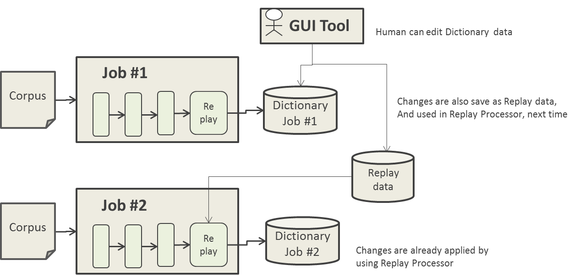
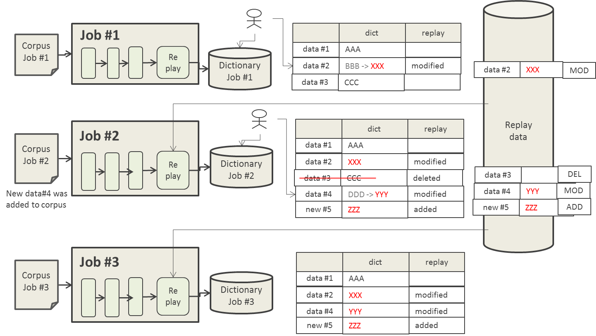
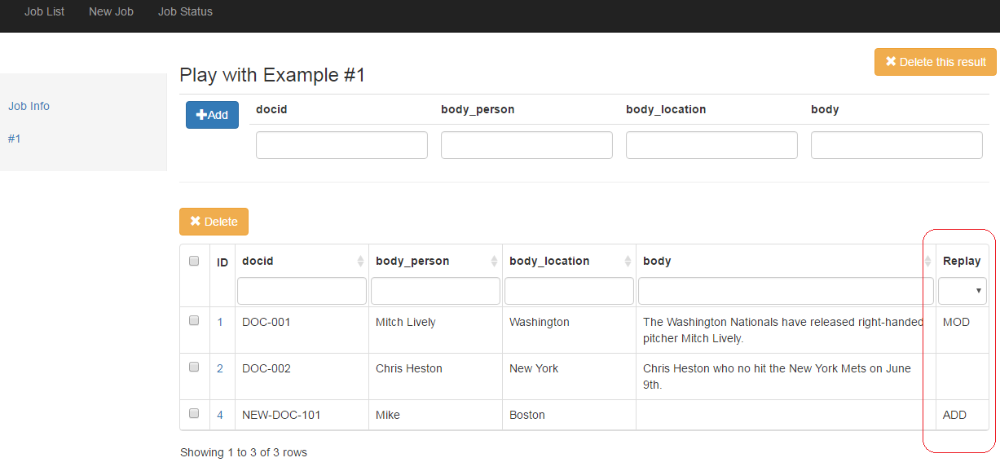

# NLP4L-DICT: Replay Function 

## Overview

The Dictionary Creation Integration Tool of NLP4L provides the Replay function as standard.

NLP4L is based on the assumption that NLP and machine learning are not perfect. The Dictionary Creation Integration Tool, therefore, is equipped with GUI so that the auto-generated dictionaries are manually modifiable through the GUI. The detail of modifications can be stored in database and the Replay function enables you to automatically apply the recorded modification processes when you create a dictionary from next time, eliminating the need for manually performing the same modifications again.



With the Replay function, you don't need to repeat the same modifications, leading to labor saving.

### Usage Scenarios 

The following diagram shows a case where a user is making modifications to a repeatedly run JOB.

- Suppose a user uses the GUI tool to modify data in Dictionary that was auto-generated in the first-run Job#1. Now, suppose the auto-generated result of "BBB" was modified to "XXX" in data#2. The GUI tool makes a modification in the Dictionary and at the same time stores the contents after the modification in the database.
- When the second Job (Job#2) is run, ReplayProcessor automatically applies the previously modified contents (contents of data#2 after the modification ie. "XXX") and automatically creates Dictionary.
- In addition, when a modification is made to data#4, the modification this time is recorded as well as the previous modification. The Replay function is applied not only to the existing data modification but also to addition (addition in new#5 in the sample diagram) and deletion (deletion in data#3 in the sample diagram) of dictionary data using GUI tool.
- In the 3rd run (Job#3), ReplayProcessor automatically applies the all modifications (modifications in data#2 and data#4 as well as the addition in #new5 and deletion in data#3) and creates Dictionary.





## Configuration

To use Replay function, you need to set ReplayProcessor in the Configuration of Job.


Refer to the following example configuration.
```
{
 processors : [
  {
   class : ...
   settings : ...
  }
  {
   class : org.nlp4l.framework.builtin.ReplayProcessorFactory
   settings : {
   }
  }
 ]
}

```

## GUI Tool

When you use the GUI tool to modify (add/change/delete) auto-generated Dictionary data, it will be displayed in the Replay row (refer to the following diagram).
Also, this information is passed to the result of Replay process after the Job re-run and is displayed in the same way.



