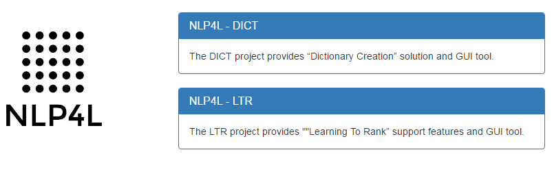
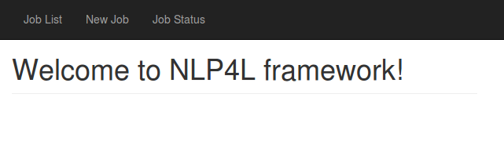
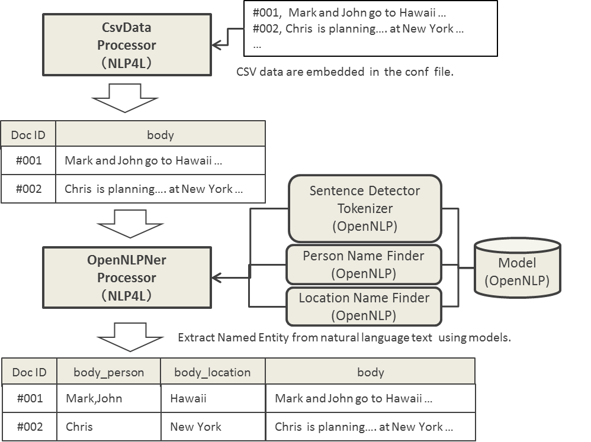
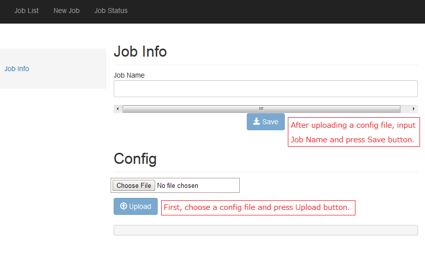

# Getting Started

## Downloading and Installing NLP4L

Download and unzip the NLP4L/nlp4l distribution file.


* Download site: https://github.com/NLP4L/nlp4l/releases

```shell
mkdir -p /opt/nlp4l
cd /opt/nlp4l

wget https://github.com/NLP4L/nlp4l/releases/download/rel-x.x.x/nlp4l-x.x.x.zip

unzip nlp4l-x.x.x.zip
cd nlp4l-x.x.x

```

## GUI Tools for NLP4L

### Starting GUI Tool Server

Start the NLP4L/nlp4l GUI tool server.

* You must have Java 1.8 or later installed to start the server.


```shell
bin/nlp4l

```
### Using GUI Tools

Go to [http://localhost:9000/](http://localhost:9000/) from your browser.

You can see Top page on your screen.
In this Getting Started we use a sample from NLP4L-DICT, click NLP4L-DICT here.



You can see a welcome message on your screen.



## Trying Out a Sample (Named Entity Extraction)

Let's run the Named Entity Extraction sample included in the distribution.

### Overview of Named Entity Extraction Sample

The Named Entity Extraction solution provided by NLP4L is a function that extracts named entities (names of people, locations, organizations, dollar figures, dates, times, etc) from text written in natural language.

This Named Entity Extraction is realized by the trained model of Name Finder provided by [Apache OpenNLP (http://opennlp.apache.org/)](http://opennlp.apache.org/).

This is a sample to show you a process of accepting document ID (docID) and text (body) as CSV data and extracting names of people (Person) and locations (Location) from the text (body).





### Downloading OpenNLP Model File

The named Entity Extraction of NLP4L uses trained models provided by [Apache OpenNLP (http://opennlp.apache.org/)](http://opennlp.apache.org/). These trained models can be downloaded from the Sourceforge site.

* Download Site for OpenNLP Trained Models: http://opennlp.sourceforge.net/models-1.5/

Named Entity Extraction of NLP4L uses trained models of Sentence and Token to extract these entities. You need to download "en" model for Language because the sample text document data is written in English.

* Sentence Detector (en): http://opennlp.sourceforge.net/models-1.5/en-sent.bin
* Tokenizer (en): http://opennlp.sourceforge.net/models-1.5/en-token.bin

In addition, you need to download trained models for names of people (Person) and locations (Location) because this sample extracts them as well.

* Name Finder Person (en): http://opennlp.sourceforge.net/models-1.5/en-ner-person.bin
* Name Finder Location (en): http://opennlp.sourceforge.net/models-1.5/en-ner-location.bin

It would be convenient if you place the downloaded file in the /opt/nlp4l/example-ner/models directory because you can use sample configurations (described later) without modifying them.

```
mkdir -p /opt/nlp4l/example-ner/models
cd /opt/nlp4l/example-ner/models

wget http://opennlp.sourceforge.net/models-1.5/en-sent.bin
wget http://opennlp.sourceforge.net/models-1.5/en-token.bin
wget http://opennlp.sourceforge.net/models-1.5/en-ner-person.bin
wget http://opennlp.sourceforge.net/models-1.5/en-ner-location.bin

```

Now the models are ready. Let's actually use the GUI Tool to run Named Entity Extraction.


### Adding a New Job

1. Click the [New Job](http://localhost:9000/dashboard/job/new) link to display the New Job screen.



2. Upload the Config file.
Specify "examples/example-opennlp-ner.conf" that is provided as a sample and click the " Upload" button.
This Config file, as explained in the previous general diagram, defines a process that reads CSV data (sample English sentence data is embedded in the Config file), uses trained models to extract named entities, and saves them as table format data (called Dictionary). We will refer to the saved result on the screen later.


```
{
 dictionary : [
  {
   class : org.nlp4l.framework.builtin.GenericDictionaryAttributeFactory
   settings : {
    name: "OpenNLPNerDict"
    attributes : [
     { name: "docId" },
     { name: "body_person" },
     { name: "body_location" },
     { name: "body" }
    ]
   }
  }
 ]

 processors : [
  {
   class : org.nlp4l.sample.SampleCsvDataProcessorFactory
   settings : {
    fields: [
     "docId",
     "body"
    ],
    data: [
     "DOC-001, The Washington Nationals have released right-handed pitcher Mitch Lively."
     "DOC-002, Chris Heston who no hit the New York Mets on June ninth."
     "DOC-003, Mark Warburton wants to make veteran midfielder John Eustace the next captain of Rangers."
    ]
   }
  }
  {
   class : org.nlp4l.framework.processors.WrapProcessor
   recordProcessors : [
    {
     class : org.nlp4l.framework.builtin.ner.OpenNLPNerRecordProcessorFactory
     settings : {
      sentModel: "/opt/nlp4l/example-ner/models/en-sent.bin"
      tokenModel: "/opt/nlp4l/example-ner/models/en-token.bin"
      nerModels: [
       "/opt/nlp4l/example-ner/models/en-ner-person.bin",
       "/opt/nlp4l/example-ner/models/en-ner-location.bin"
       ]
      nerTypes: [
       "person",
       "location"
      ]
      srcFields: [
       "body"
      ]
      idField:  "docId"
      passThruFields: [
       "body"
      ]
      separator: ","
     }
    }
   ]
  }
  {
   class : org.nlp4l.framework.builtin.ReplayProcessorFactory
   settings : {
   }
  }
 ]
}

```

3. Input a name of job in the Job Name text box and click the Save button.
Now you have a new job added.


### Running a Job

The Run button is displayed when a Job is added. Let's click the Run button to run the Job.
You can see the started Job on the [Job Status](http://localhost:9000/dashboard/job/status) screen.


Status becomes "Running" while a job is running.
Status becomes "Done" and the result is displayed when a job completes.


### Job Result

Execution results of job can be displayed on the result screen of that job. You can go to the screen by (a) clicking the JobID of the job you want to see or (b) clicking the JobID (#1) displayed towards the left side of Job Info screen.

As described in the following result screen, you can see that named entities (in this case, names of people and locations) are extracted.


