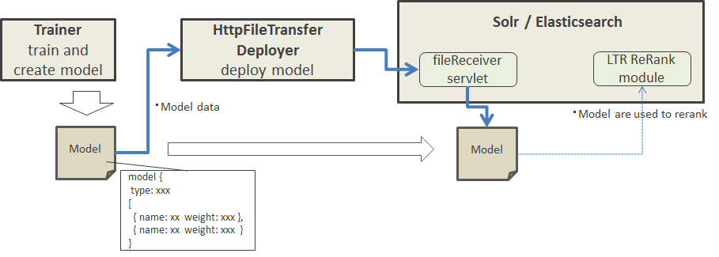
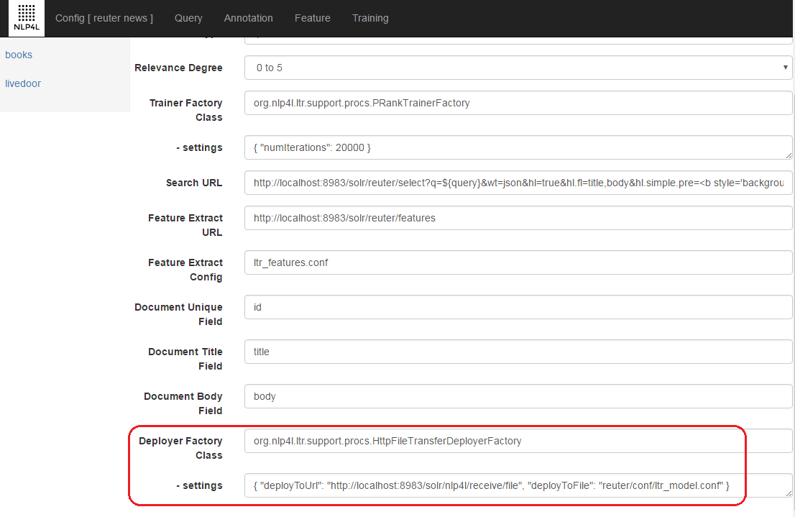

# NLP4L-LTR: HTTP File Transmission Deployer
## Overview

HTTP File Transmission Deployer is a plug-in program that uses HTTP protocol to send model data, which is output as the result of learning to rank, to the search server (Solr/ES) side.

## Config
Set Config as follows to use HTTP File Transmission Deployer.

### Deployer Factory Class Setting

Specify org.nlp4l.ltr.support.procs.HttpFileTransferDeployerFactory as Deployer Factory Class.

### settings

Settings available for HTTP File Transmission Deployer are as follows.

|name|required|default|description|
|:--|:--:|:--:|:--|
|deployToUrl|true|-|URL to deploy to Ex: http://localhost:8983/solr/nlp4l/receive/file|
|deployToFile|true|-|file name to save as Ex: collection1/conf/ltr_model.conf|

## Server-side Settings

Refer to "[NLP4L solr Project](https://github.com/NLP4L/solr)" for the settings of search server to deploy to.	

