# NLP4L-LTR： GUIツール利用ガイド

## 概要

ここでは、NLP4Lのランキング学習ツールで提供されているGUIツールの利用方法、および、各画面の操作を説明していきます。

GUIツールは、5つのメニューから構成されています。


|menu|description|
|:--|:--|
|Config|ランキング学習を行う上で、学習モデルの種類や、検索サーバ(Solr/ES)のURL指定など、各種設定を行います。<br>複数の設定を保持することができ、指定(Load)した設定に従ってQuery/Annotation/Feature/Trainingが動作します。|
|Query|クエリー文字列の一覧管理を行います。<br>Annotationで使用するクエリーの一覧が表示されます。クエリー文字列を記述したファイルをアップロードして登録したり、不要なクエリーの削除などの操作を行います。<br>また、実アプリケーションでユーザが検索してクリックしたログを分析して、アノテーション付きクエリーデータとして、インポートすることも出来ます。|
|Annotation|検索サーバ(Solr/ES)に対して、クエリーを実行し、クエリー結果のドキュメント一覧に対して、ランキング評価(アノテーション付け)を行います。<br>アノテーション付けは、関連度合の高いドキュメントに対して、星マークを付けることで行います。|
|Feature|クエリーと評価したドキュメントに対する各種Featureの抽出を行います。<br>Featureの抽出は、検索サーバ(Solr/ES)側で行われるため、サーバ側で事前に設定されている必要があります。|
|Training|クエリーのランキング評価と各種Featureデータを元に(すなわち、教師ありデータを元に)、機械学習トレーニングを実行し、モデルを生成します。<br>また、生成された学習モデルを、サーバ側にデプロイすることも出来ます。|


各画面の上部に表示されているのが、メニューです。

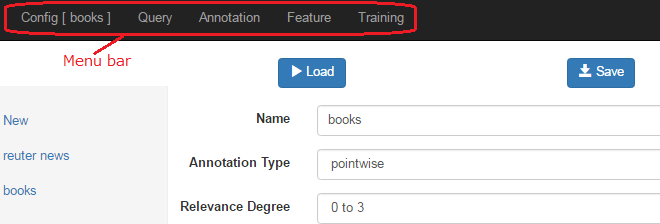


以下に、それぞれのメニュー毎に、詳細を説明していきます。

## Config画面

Config画面では、学習モデルの種類、関連度合のレベルや、検索サーバ(Solr/ES)のURL指定など、各種設定を行います。

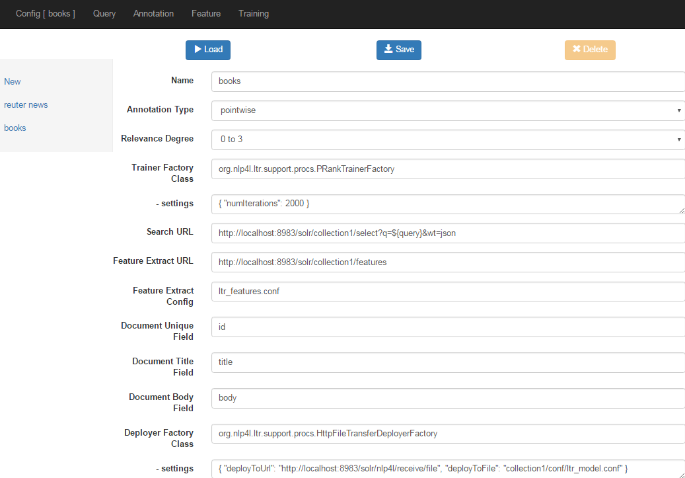

具体的な設定項目は、以下の通りです。

|field|description|
|:--|:--|
|Name|コンフィグレーションの名前。<br>複数のコンフィグ設定を保持可能なため、名前で識別できるようにしておく。|
|Annotation Type|pointwise / pairwise / listwise。（現時点では pointwiseのみサポート）|
|Relevance Degree|ランク付けの関連度合レベルの設定。1～5までの5段階より選択。<br>ここで設定した値に従い、Annotation画面のランク付けで最大表示される星印の数が決まる。|
|Trainer Factory Class|機械学習トレーニングを行うFactoryClassを指定する。<br>例: org.nlp4l.ltr.support.procs.PRankTrainerFactory|
|- settings|上記のTrainer Factory Classに引き渡される設定。<br>例: { "numIterations": 2000 }|
|Search URL|検索サーバ(Solr/ES)のURL。（現時点では Solrのみサポート）<br>${query}の箇所がクエリー文字列に置き換えられて検索サーバへリクエストが送られる。<br>JSON形式でリプライを受け取ることを想定しているため、wt=jsonを付加する必要がある。<br>ハイライトなどの指定も可能。<br>例: http://localhost:8983/solr/collection1/select?q=${query}&wt=json|
|Feature Extract URL|Feature抽出用の検索サーバ(Solr/ES)のURL。（現時点では Solrのみサポート）<br>サーバ側でFeature抽出用の設定が必要。<br>例: http://localhost:8983/solr/collection1/features|
|Feature Extract Config|Feature抽出時に検索サーバ側で使用するコンフィグファイル名。<br>例: ltr_features.conf|
|Document Unique Field|ドキュメントのユニークフィールドの名前。<br>例: id|
|Document Title Field|ドキュメントのTitleフィールドの名前。<br>例: title|
|Document Body Field|ドキュメントのBodyフィールドの名前。<br>例: body|
|Deployer Factory Class|生成したモデルのデプロイを行うFactoryClassを指定する。<br>例: org.nlp4l.ltr.support.procs.HttpFileTransferDeployerFactory|
|- settings|Deployer Factory Classに引き渡される設定。<br>例:<br>{ "deployToUrl": "http://localhost:8983/solr/nlp4l/receive/file", <br>  "deployToFile": "collection1/conf/ltr_model.conf" }|

#### 新規作成(New)

画面左のサイドバーのNewリンクを押下すると、Configの新規登録が出来ます。

各フィールドを設定後、Saveボタンを押下すると、新規登録されます。

（新規登録した設定を使用して、Query/Annotation/Feature/Trainingを行うためには、保存(Save)後にLoadボタンを押下する必要がありますので、ご注意ください。）

#### 変更・削除

画面左のサイドバーに表示されたコンフィグの一覧から、編集したいコンフィグのリンクを押下すると、そのConfigの設定が変更可能となります。設定を編集後、Saveボタンを押下することで、設定が変更されます。

また、Deleteボタンを押下すると、削除できます。(削除は、削除対象のConfigがLoadされている状態の時は削除できません。一旦他のConfigをLoadしてから、削除対象のConfigを選択して削除するようにしてください。)

#### Configの切り替え

ランキング学習ツールでは、複数のConfigを設定・保持して、切り替えて使用することが出来ます。

Configの切り替えは、画面左のサイドバーに表示されたConfigの一覧から、使用したいConfigのリンクを押下して選択し、Loadボタンを押下することで切り替わります。現在使用中のConfigの名前が、画面上部メニューのConfigの横に表示されます。

ランキング学習（Query/Annotation/Feature/Training）は、現在使用中(Loadした)Configの設定に従い、動作します。

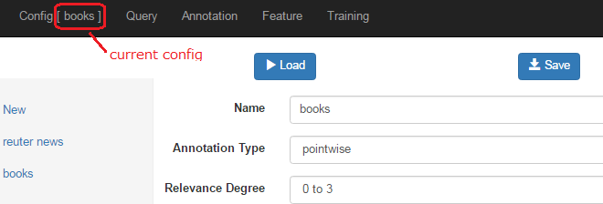


## Query画面

Query画面では、Queryの一覧を管理します。

この画面では、Annotationで使用するQueryの一覧が表示されます。Annotation済のQueryに関しては、Annotation Status欄にdoneと表示されます。

Query文字列のリンクを押下すると、Annotation画面に遷移します。

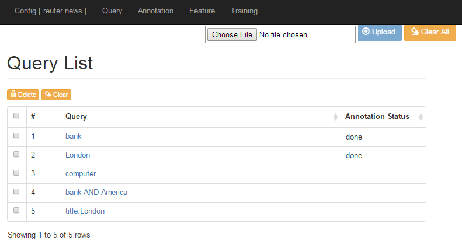


#### Query文字列ファイルのアップロード
Query文字列の一覧に新規登録するには、Query文字列を記述したファイルをファイル選択ボタンで選択した後、アップロードボタンを押下します。

既存のQueryリストが存在する場合、アップロード登録は既存データの後ろに追加挿入されます。

Query文字列を記述したファイルの例を以下に示します。

```
bank
London
computer
bank AND America
title:London
:
```

#### Queryの削除とクリア

Queryを削除するには、対象となるQueryのチェックボックスを選択し、テーブル左上のDeleteボタンを押下します。

Annotation済みQueryに対して、Annotationデータをクリアするには、対象となるQueryのチェックボックスを選択し、テーブル左上のClearボタンを押下します。また、全てのQueryのAnnotationデータをクリアしたい場合には、画面右上のClear Allボタンを押下します。

#### インポート

外部からデータをインポートする場合には、Importボタンを押下します。Importボタンを押下すると、Data Import用の画面に遷移します。

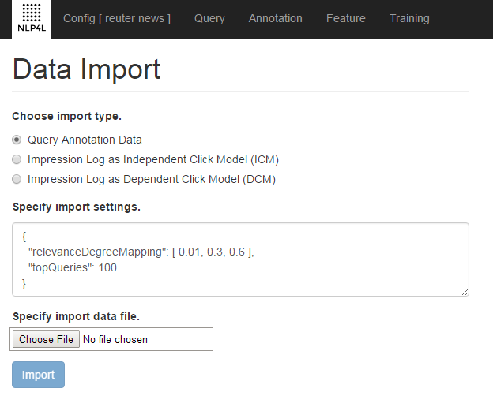

インポート機能に関しては、[クリックログ分析とインポート](ltr_import_ja.md)を参照してください。


## Annotation画面

Annotation画面では、検索サーバ(Solr/ES)に対して、Queryを実行し、Query結果のドキュメント一覧に対して、ランキング評価(Annotation付け)を行います。

#### Annotation付けと保存(Save)
ランキング学習ツールにおけるAnnotation付けは、検索結果のドキュメントに対して、星マーク付けを行うことで実現されます。

Annotation画面にて、検索結果の各ドキュメントに対して評価を行い、関連度合の高いドキュメント(ランキング上位に来て欲しいドキュメント）の星マーク（relevance degree欄）数を設定することにより行います。

１つのQueryに対し、一通りのAnnotation付け（星マーク付け）が済んだら、Saveボタンを投下して、Annotationデータを保存します。（星マークを付けただけではデータ保存されませんので、Saveボタンの押下を忘れないでください。）

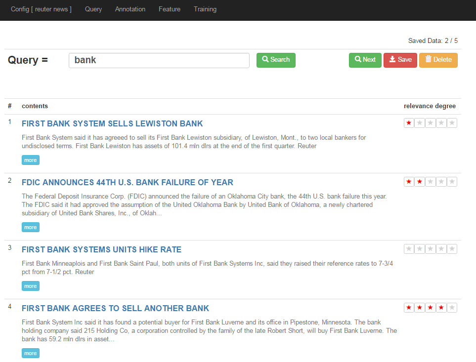

#### ハイライト表示

Query結果一覧のタイトルとボディ欄に、ハイライト表示することも可能です。

ハイライト表示するには、検索サーバ(この例ではSolr)からハイライト情報を返してもらう必要があるため、ConfigのSearch URLの指定で行います。

以下の例では、ハイライトを黄色背景表示させるSearch URLの例です。（Search URLのQueryパラメータの指定に関しては、Solrのドキュメントを参照してください。）

```
http://localhost:8983/solr/collection1/select?q=${query}&wt=json&hl=true&hl.fl=title,body&hl.simple.pre=<b style='background:yellow'>&hl.simple.post=</b>&hl.snippets=3&hl.fragsize=300
```

この設定を行うことにより、以下のようなAnnotation画面が表示されます。

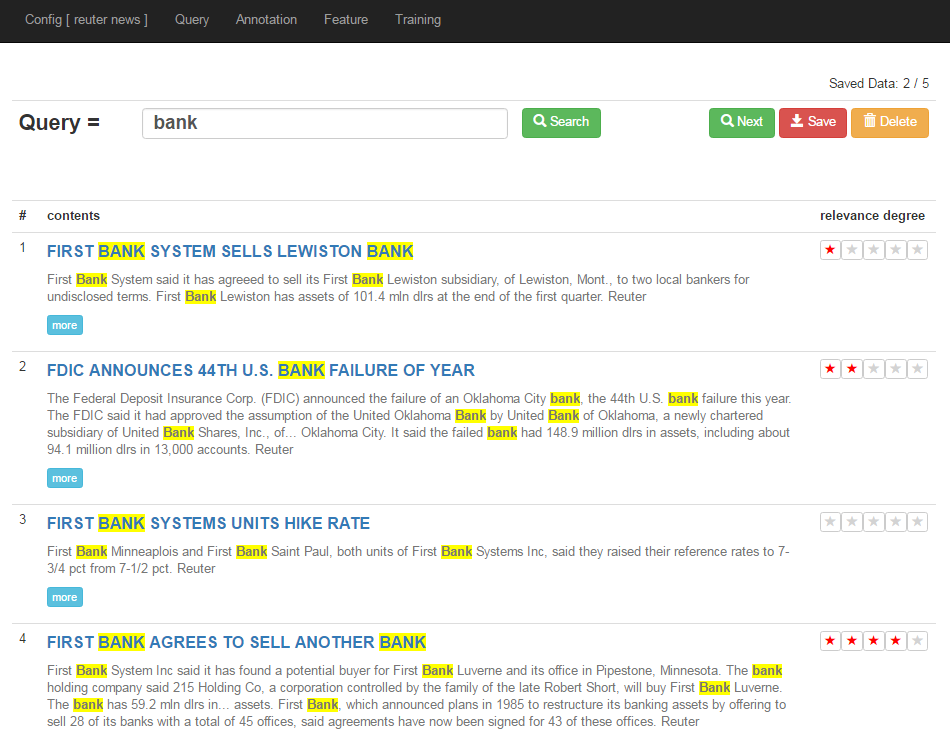

#### 詳細表示(moreボタン)
Query結果一覧に表示されるのは、タイトルとボディの一部ですが、さらに詳細を見たい場合があります。
このような場合には、moreボタン（またはタイトルのリンク）を押下すると、詳細ダイアログがポップアップして、全てのフィールドの値が参照できます。

ポップアップしたダイアログ側でも、Annotation付け(星マーク付け)を行うことが出来ます。

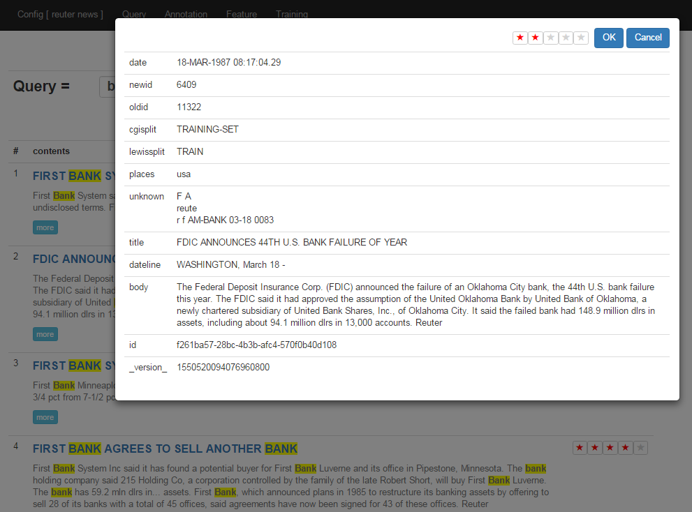

#### Query文字列入力欄と検索(Searchボタン)

事前に登録したQuery文字列で検索した結果、さらに、Query文字列に追加変更を加えて、評価したい場合があります。このような場合、Query文字列入力欄の文字列修正し、Searchボタンを押下することで、修正したQuery文字列の検索結果に対して、Annotationを行うことが出来ます。

例えば、事前に「bank」というQuery文字列を登録してQueryを行った結果、学習に使用するのに相応しくないQuery文字列だということであれば、例えば「bank and London」とQuery文字列を変更して、Searchボタンを押下し、その検索結果に対して、Annotationを行い、Saveボタンを押下します。

新しいQuery文字列(「bank and London」)は、QueryListの最後に自動的に追加されます。（元のQuery文字列の書き換えが行われる訳ではない点に注意してください。）


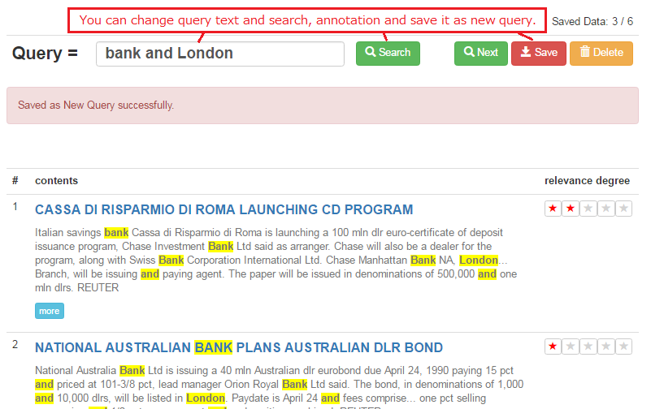

Query画面で見ると、最後に新しいQueryが追加されていることが確認できます。

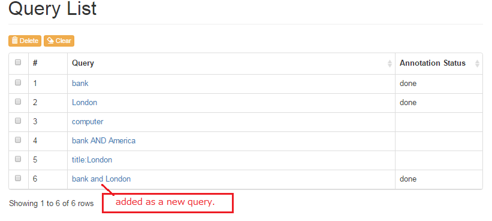

このQuery文字列入力欄とSearch、Saveボタンの機能を利用することにより、事前にQuery文字列を準備していなくても、自由にQuery文字列を指定して検索して、Annotation付けを行いながら、Query文字列登録を行うことも可能となります。

#### 次のQueryへ(Nextボタン)

Nextボタンを押下した場合、Queryリストの中で、現在のQueryより後ろの、まだAnnotation済みでない次のQuery文字列が自動選択されて、検索されます。

後ろにAnnotation済みでないQueryが存在しない場合、「No queries.」とメッセージ表示されます。

#### Menuバーからの遷移の場合
画面上部のMenuバーの「Annotation」リンクから遷移した場合、まだAnnotation済みでない、先頭のQuery文字列が自動選択されて、検索されます。

#### Query文字列の削除(Deleteボタン)

Deleteボタンを押下すると、Annotationデータがクリアされるだけでなく、Query一覧からも削除されます。
例えば、実際にQuery検索をして見た結果、学習には相応しくないQuery文字列だと判断して一覧から削除したい場合などに利用します。


## Feature画面

Features画面では、QueryとAnnotation付けしたドキュメントに対する各種Featureの抽出を行います。

Featureの抽出は、検索サーバ(Solr/ES)側で行われるため、サーバ側で事前に設定されている必要があります。また、どのようなFeatureを取得するかは、サーバ側の設定となります。

ここではサーバ側の記載は省略します。
サーバ側の設定に関しては、「[NLP4Lのsolrプロジェクト](https://github.com/NLP4L/solr)」の設定を参照してください。

#### Featureの抽出

Extractボタンを押下することにより、Featureの抽出が始まります。

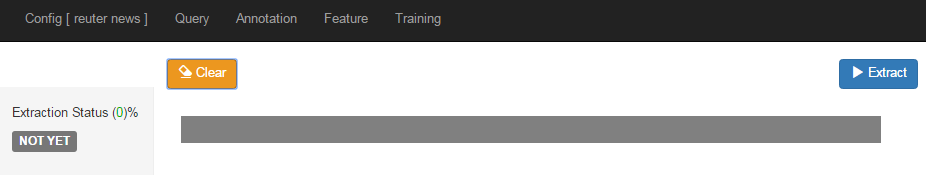

Extraction StatusがDONE状態になれば、抽出完了です。

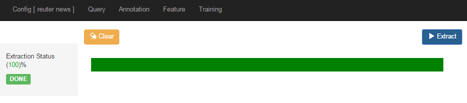

再度Extractする場合には、Clearしてから、Extractを行うようにして下さい。


## Training画面

Training画面では、QueryとAnnotation、さらに抽出した各種Featureデータを元に、ランキング学習トレーニングを行い、モデルを生成します。

#### 新規トレーニング＆モデル生成

新規にトレーニングを実行してモデル生成を行うには、まず、画面左側のサイドバーのNewリンクを押下して、新規作成画面を表示されます。

Featuresには、ExtractしたFeatureの一覧が表示されます。

ここで、使用するFeatureをチェックボックス選択し、Startボタンを押下すると、トレーニングが開始されます。

トレーニングとモデル生成は、Configで設定したTrainer Factory Classが生成したTrainerが処理を行います。

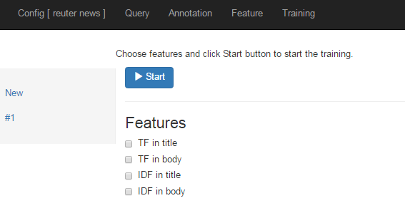

トレーニングが終了し、モデルが生成されると、生成されたモデルデータを見ることが出来ます。

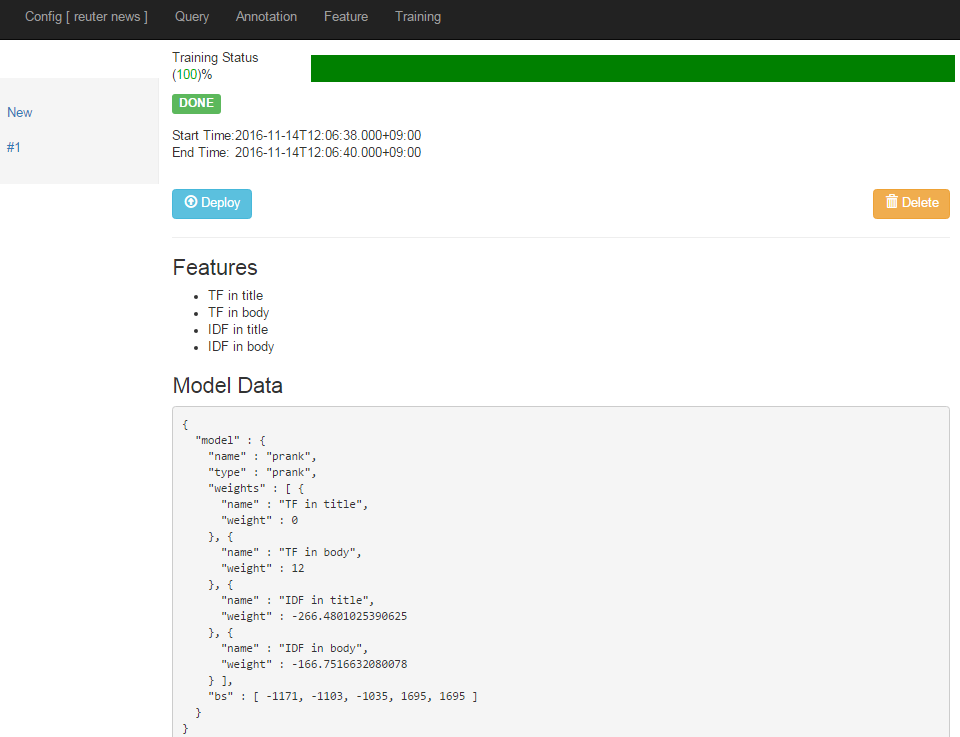

#### モデルのデプロイ

生成したモデルデータをデプロイするには、Deployボタンを押下します。

実際のDeployは、Configで設定したDeployer Factory Classが生成したDeployerが行います。

Deployが成功すると、Successと表示されます。

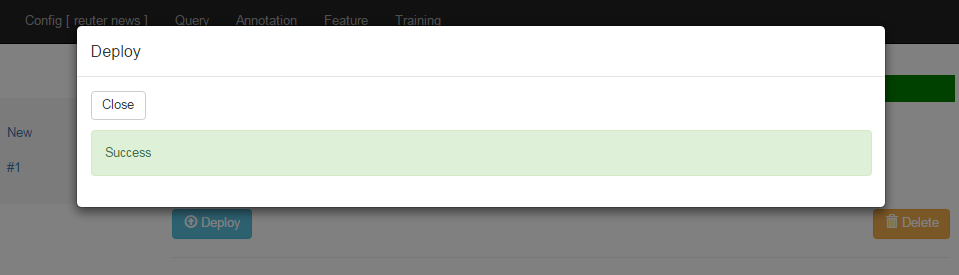

#### モデルの削除

Deleteボタンを押下すると、生成したモデルが削除されます。

以上


