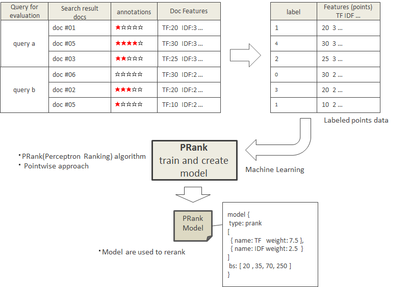
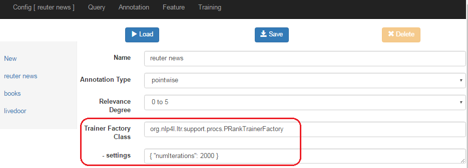

# NLP4L-LTR： PRankモデル

## 概要

NLP4L-LTR は、Pointwise アプローチの1つとして Perceptron Ranking アルゴリズムを利用して実装された PRank のランキング学習プログラムを提供しています。

NLP4L-LTR を使用して作成・抽出した訓練データと Feature データを元に、PRank のランキング学習を行い、モデルデータを生成します。




## Config
PRank プログラムを使用するには、Configに以下のように設定します。




### Trainer Factory Class設定

Trainer Factory Classには、org.nlp4l.ltr.support.procs.PRankTrainerFactoryと指定します。

### settings設定

PRankモデルで設定可能なsettingsは、以下の通りです。

|name|required|default|description|
|:--|:--:|:--:|:--|
|numIterations|false|2000|トレーニングを繰り返す回数。|

## モデルデータ
PRankモデルのデータは、以下のようなJSON形式で出力されます。

各Featureの重み付け(weight)と、ランキング判定用の境界スコア値(bs)が含まれています。


```
{
  "model" : {
    "name" : "prank",
    "type" : "prank",
    "weights" : [ {
      "name" : "TF in title",
      "weight" : 75
    }, {
      "name" : "TF in body",
      "weight" : -115
    }, {
      "name" : "IDF in title",
      "weight" : -331.22149658203125
    }, {
      "name" : "IDF in body",
      "weight" : -293.4493103027344
    } ],
    "bs" : [ -1230, -694, 44, 44, 1872 ]
  }
}
```
