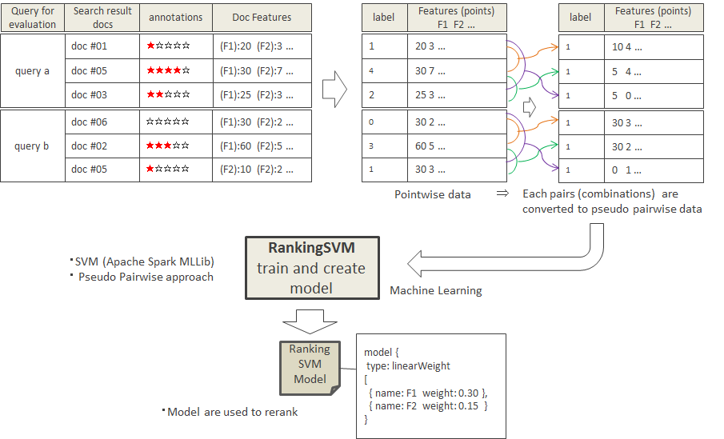
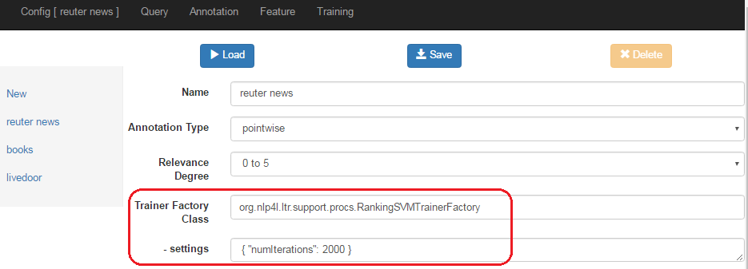

# NLP4L-LTR： RankingSVMモデル

## 概要

NLP4L-LTR は、Pairwise アプローチの1つとして SVM(support vector machine) アルゴリズムを利用して実装された RankingSVM のランキング学習プログラムを提供しています。SVM の学習には、[Apache Spark (http://spark.apache.org/)](http://spark.apache.org/)で提供されている MLlib を使用しています。

NLP4L-LTR を使用して作成・抽出した訓練データと Feature データを元に、RankingSVM のランキング学習を行い、モデルデータを生成します。なお、NLP4L-LTR の RankingSVM プログラムでは、Pointwise データから疑似的に Pairwise データを生成して処理を行います。




## Config
RankingSVMモデルを使用するには、Configに、以下のように設定します。




### Trainer Factory Class設定

Trainer Factory Classには、org.nlp4l.ltr.support.procs.RankingSVMTrainerFactoryと指定します。

### settings設定

RankingSVMモデルで設定可能なsettingsは、以下の通りです。

|name|required|default|description|
|:--|:--:|:--:|:--|
|numIterations|false|2000|トレーニングを繰り返す回数。|

## モデルデータ
RankingSVMモデルのデータは、以下のようなJSON形式で出力されます。

各Featureの重み付け(weight)が含まれています。


```
{
  "model" : {
    "name" : "linearWeight",
    "type" : "linearWeight",
    "weights" : [ {
      "name" : "TF in title",
      "weight" : 0.16256159599933862
    }, {
      "name" : "TF in body",
      "weight" : 0.4760258564550035
    } ]
  }
}
```
