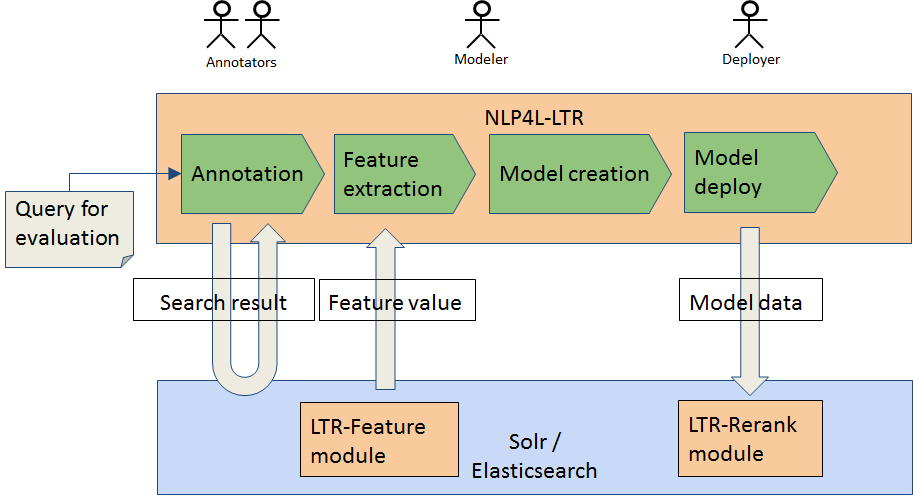
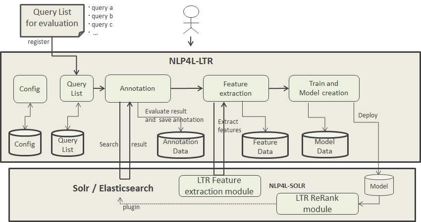

# NLP4L-LTR ランキング学習ツール

## コンセプト

NLP4L-LTR は、検索エンジン（Solr, Elasticsearch）にランキング学習機能を組み込むために必要なソリューションを提供します。

ランキング学習のフレームワークは次のようなフェーズに分かれています。

1. 教師データ生成
2. Feature抽出
3. モデル生成
4. モデル配置

ランキング学習に関するモデルは様々なものが存在していますが、NLP4L-LTR は特定のモデルに依存せず利用可能となっています。そのため、新しいランキング学習のモデルを実装したプログラムを組み込む場合でも、本ツールが提供する少しのインターフェイスを実装するだけで、NLP4L-LTR のフレームワーク上で稼働させることができます。

### 教師データ生成について

NLP4L-LTR が提供するランキング学習は、教師あり学習となります。そのため、あるクエリについてどの文書がどのくらい関連するかというデータが必要になってきます。このデータを用意するには、以下のような方法が考えられます。

- アノテーターがAnnotation付けを行う。
- クリックログを分析して作成する。

これらはそれぞれ一長一短があります。アノテーターがAnnotation付けを行う方法は確実性が高いですがコストがかかり、時間経過と共にアノテーションデータが劣化する可能性があります。一方、クリックログを分析する方法はコストがかかりませんが、ノイズが発生し、その性質もアプリケーション依存のところが多分にあります。

## アーキテクチャー

ランキング学習ツールのアーキテクチャを以下に示します。

## 機能概要

以下に、ランキング学習ツールで提供されている機能の概要を示します。上図と合わせて、ご覧ください。

###  Config
Configでは、ランキング学習ツールを動作させていく上での各種設定を行います。

- アノテーション方法の選択（Pointwise, Pairwise, Listwise） （現在はPointwiseのみサポート）
- 検索サーバ（Solr/Elasticsearch）のURL指定 （現在はSolrのみサポート）
- Features取得方法、Features項目定義
- ドキュメントのid, titile, bodyフィールド名の指定
- 学習モデル生成のためのFactoryクラス名
- デプロイのためのFactoryクラス名

###  Query List
Query Listでは、学習データの元になるクエリーのリストを管理します。

- 学習データの元になるクエリーの一覧とステータス
- クエリーファイルからのアップロード登録

###  Annotation
Annotationでは、検索サーバ(Solr/Elasticsearch)に対して検索を実行し、検索結果一覧中の各文書に対して、人手でアノテーション付けを行います。アノテーション付けは、本ツールが提供する GUI を使って、関連度合に応じて星マークを付けることで行います。

- 検索サーバへのクエリ問い合わせ、結果ドキュメントの一覧表示
- Annotation付けと、Annotationデータ保存

###  Click Model
（現在執筆中）

###  Feature extraction

Solr/ElasticsearchのLTR-Featureモジュールと連動し、学習データに関するFeatureの値を取得します。取得したFeatureデータは、モデル生成時に利用されます。

- 学習データに関するFeatureの値の取得
- Solr/ElasticsearchのLTR-Featureモジュールとの連動
- Featureデータの保存

###  Train and Model creation

上述のランキング学習データを利用して、トレーニングを行い、モデルデータを生成します。

トレーニングには、Configで設定した学習モデル生成Factoryクラスが利用されるため、様々なモデル実装を利用することができます

- ランキング学習データを利用した機械学習とモデルの生成
- 生成したモデルのSolr/Elasticsearchへの配備(デプロイ)

生成・配備されたモデルは、Solr/ElasticsearchのLTR-ReRankモジュールと連動して、検索時のReRankに利用されます。

## NLP4LのSolrプロジェクト

ランキング学習ツールは、Solr/Elasticsearch側のLTRモジュールと連動して動作します。（現時点では、Solrのみサポート）

Solr側の機能や設定に関しては、「[NLP4LのSolrプロジェクト](https://github.com/NLP4L/solr)」を参照してください。

## 標準提供のモデル

NLP4Lでは、予め実装されたビルトインの学習モデル生成クラスが提供されています。

|モデル|アプローチ|説明|
|:--|:--|:--|
|PRank|Pointwise|PRank(Perceptron Ranking)アルゴリズムを利用したモデル|
|RankingSVM|疑似Pairwise|SVM(support vector machine)を用いたモデル。 Pointwiseデータから疑似的にPairwiseデータに変換して処理を行う。|

これらの標準提供モデル関しては、 [NLP4L-LTR User's Guide](ltr_users_guide_ja.md)を参照してください。

## ユーザ開発のモデル

NLP4Lでは、ビルトインのモデルだけでなく、ユーザがモデルを開発することも想定しています。

詳しくは、[NLP4L-LTR Programmer's Guide](ltr_programmers_guide_ja.md)を参照してください。
