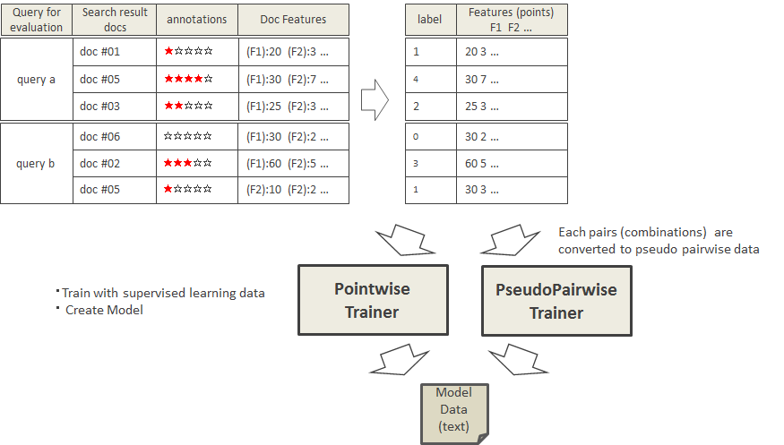

# NLP4L-LTR: Programmer's Guide


## Overview

NLP4L-LTR is designed not only to use the built-in learning to rank algorithm but also allow a user to develop plug-ins that implement his/her own learning to rank algorithm.

Following is information for users who want to develop such plug-ins.


## Developer's Library 

In addition to the learning to rank tool framework, NLP4L provides a library that contains modules essential for developers.

Refer to the following sample settings to obtain the library.
 (The following examples assume the version of library is nlp4l-framework-library_2.11-0.5.0.) 

SBT Sample Setting
```
libraryDependencies += "org.nlp4l" % "nlp4l-framework-library_2.11" % "0.5.0"
```
Ivy Sample Setting
```
<dependency org="org.nlp4l" name="nlp4l-framework-library_2.11" rev="0.5.0"/>
```
Maven Sample Setting
```
<dependency>
  <groupId>org.nlp4l</groupId>
  <artifactId>nlp4l-framework-library_2.11</artifactId>
  <version>0.5.0</version>
</dependency>
```


## API Docs

API documents are provided in the following.

* API Docs: http://nlp4l.github.io/


## Developing User's Original Learning to Rank Plug-in  

User can develop his/her own learning to rank plug-ins as follows.

The learning to rank plug-ins run on NLP4L-LTR framework and learn training data to generate the learning to rank model file. As it mainly handles training, a developed plug-in is called Trainer and would implements the Trainer abstract class (trait).

### Implementing TrainerFactory 

In order to implement Trainer, you first need TrainerFactory, i.e., a Factory that generates Trainer.

- Generate a class that inherited TrainerFactory and implement the getInstance function.
- As the settings (Config class) set in Configuration is passed to as arguments, get the parameters from settings as needed.
- Instantiate the Trainer class.

```
import com.typesafe.config.Config
import org.nlp4l.ltr.support.procs._

class MyModelTrainerFactory(settings: Config) extends TrainerFactory(settings) {

 override def getInstance: Trainer = {
  new MyModelTrainer(getIntParam("numIterations", 2000))
 }
}
```

### Types of Trainer

The learning to rank tool provides the following types of Trainer and each Trainer is implemented a little differently according to its type.

|type|description|
|:--|:--|
|Pointwise|Pointwise type trainer|
|pseudoPairwise|trainer to convert Pointwise type data artificially to Pairwise type before processing|
|Pairwise|Pairwise type trainer (Currently not supported)|



### Implementing Trainer(Pointwise)

- Create a class that inherits PointwiseTrainer to implement the train function.
- Receive the learning data (Pointwise type), which is passed as the argument of train function, and implement the process.
- Create model data and return it as the return value of train method.

##### Explanation of Arguments
|argument|type|description|
|:--|:--|:--|
|featureNames|Array[String]|array of selected Feature names|
|features|Array[Vector[Float]]|array of Feature value Vectors for training data (each annotated document) <br>Feature value Vectors are in the order of featureNames.|
|labels|Array[Int]|array of label values (the number of annotated stars) of training data.<br> array is in the same order as features|
|maxLabel|Int|the largest label value of training data (the largest value that Relevance Degree, which is set in Config, can hold).|
|progress|TrainingProgress|Notification interface for ProgressBar|


##### Sample Code
```

class MyModelTrainer(val numIterations: Int) extends PointwiseTrainer {

 def train(featureNames: Array[String],
      features: Array[Vector[Float]],
      labels: Array[Int],
      maxLabel: Int,
      progress: TrainingProgress) : String = {
   :
  progress.report(10)
   // train and create model
  val modeldata = ...
   :
  progress.report(100)
  modeldata
 }
}
```

### Implementing Trainer (pseudoPairwise) 

- Create a class that inherited PseudoPairwiseTrainer and implement the train function.
- Receive learning data (pseudoPairwise type), which is passed as an argument of train function, and implement the process.
- Create model data and return it as the return value of train method.

##### Explanation of Arguments
|argument|type|description|
|:--|:--|:--|
|featureNames|Array[String]|array of selected Feature names|
|features|Vector[Vector[(Int, Vector[Float])]]|feature value Vector and label value for training data for each query.<br>this data structure is adopted as it is assumed that artificial conversion to Pairwise data is performed for each query.<br>vector for each query[<br>&nbsp;&nbsp;&nbsp;&nbsp;training data vector[<br>&nbsp;&nbsp;&nbsp;&nbsp;&nbsp;&nbsp;&nbsp;&nbsp;(label value , feature value vector)<br>&nbsp;&nbsp;&nbsp;&nbsp;]<br>]|
|progress|TrainingProgress|notification interface for ProgressBar|


##### Sample Code


```

class MyModelTrainer(val numIterations: Int) extends PseudoPairwiseTrainer {

 def train(featureNames: Array[String],
      features: Vector[Vector[(Int, Vector[Float])]],
      progress: TrainingProgress) : String = {
   :
  progress.report(10)
   // train and create model
  val modeldata = ...
   :
  progress.report(100)
  modeldata
 }
}
```

