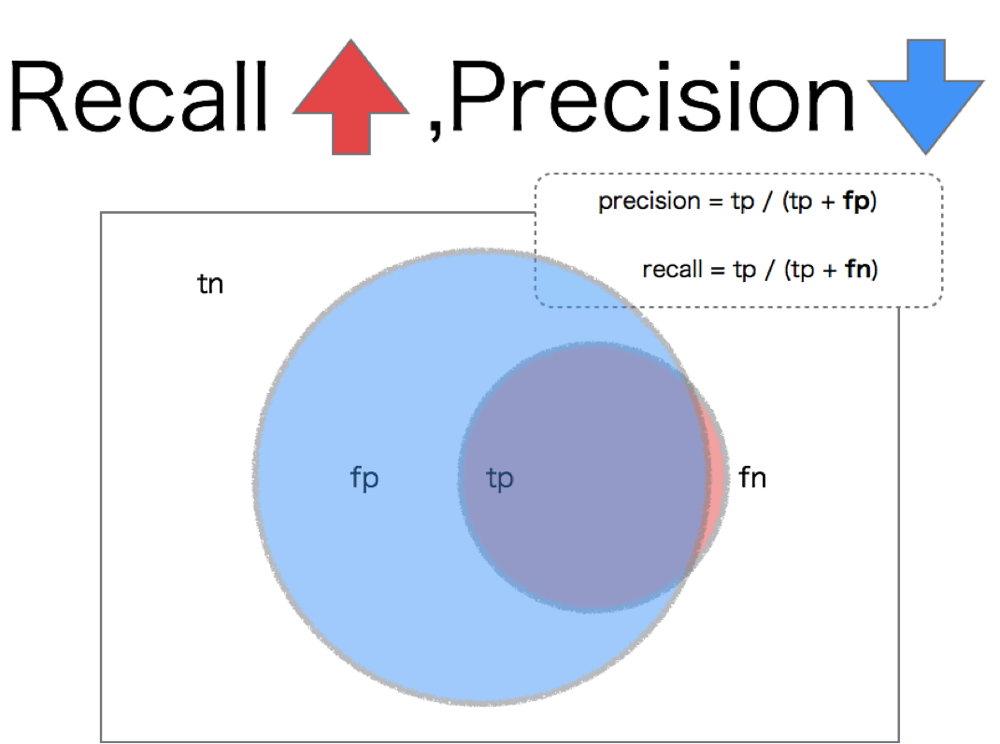
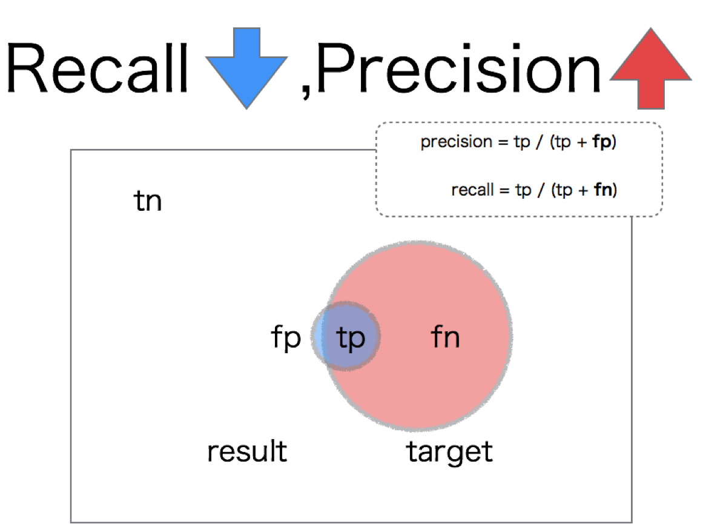
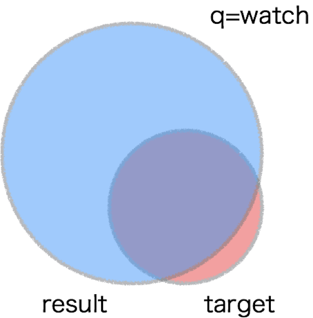
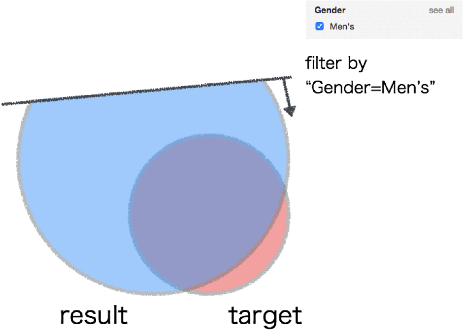
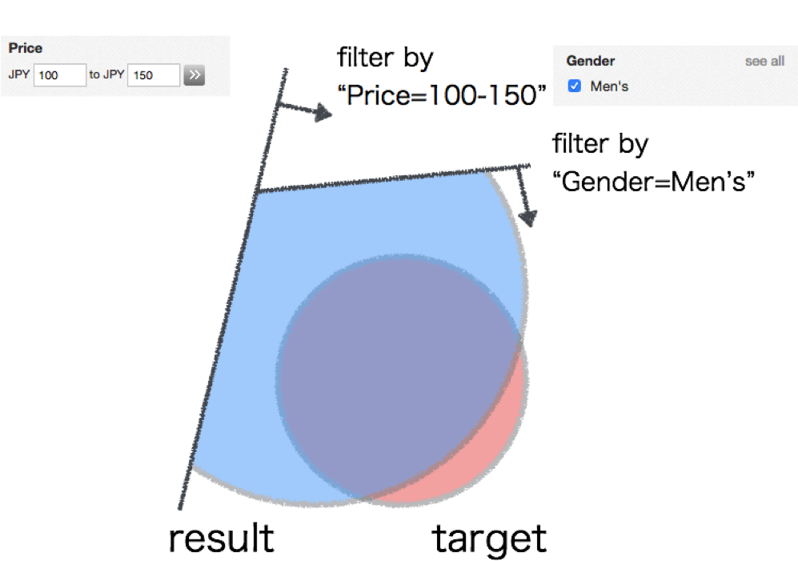
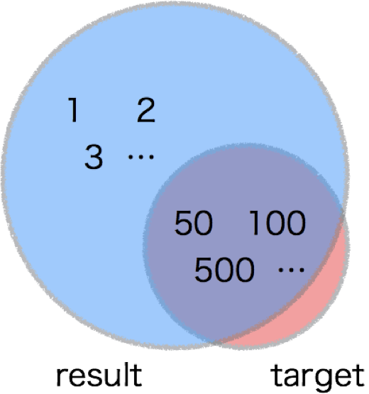
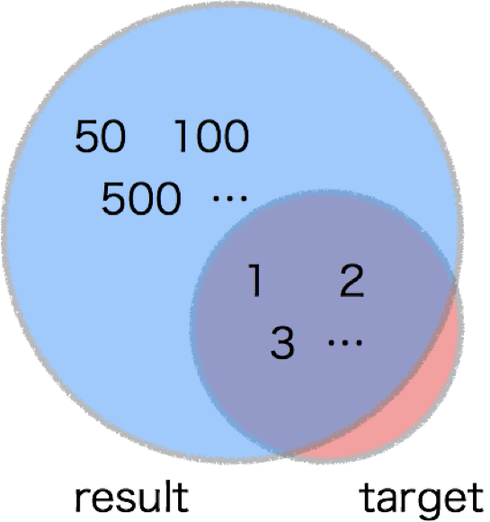
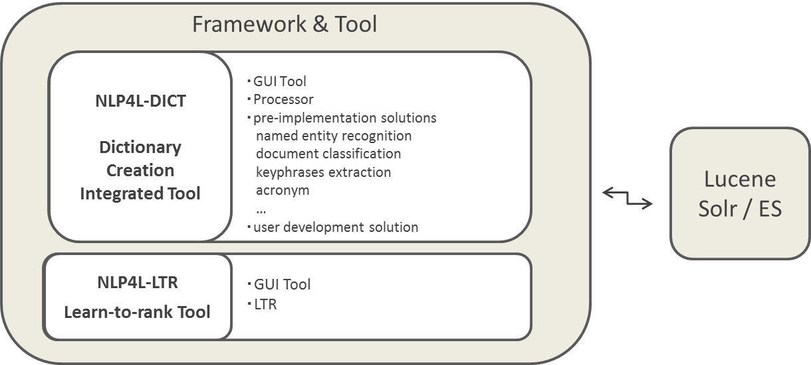

# Project Overview

* [NLP4Lとは？](#NLP4Lとは？)
* [基本戦略](#基本戦略)
* [プロジェクトのゴール](#プロジェクトのゴール)
* [フレームワークとツール](#フレームワークとツール)

## NLP4Lとは？

NLP4L は Scala で書かれた [Apache Lucene](https://lucene.apache.org/core/) のための自然言語処理ツールです。NLP4L は、NLP（自然言語処理）および機械学習の技術を用いて検索エンジンユーザの検索エクスペリエンスを向上させることを主な目的としています。NLP4L の「4L」は、「for Lucene」を表していますが、具体的な検索エンジンとしては Lucene ベースの [Apache Solr](http://lucene.apache.org/solr/) と [Elasticsearch](https://www.elastic.co/products/elasticsearch) をターゲットにしています。なお、以下で述べる NLP4L の戦略は情報検索一般で成り立つため、Lucene 以外の商用検索エンジンなどでも NLP4L を組み合わせて使うことができます。

ところで「検索エンジンユーザの検索エクスペリエンスを向上させる」とはどういうことでしょうか？平たく言えば、「ユーザが見つけたいと思っている文書をより早く容易に見つけられるようにする」ということです。そのために、NLP4L プロジェクトでは以下のことを実施します。

1. トレードオフの関係にある再現率と精度の両取りをするための方式の提案とツールの提供
1. 検索補助ツール（オートコンプリート、もしかして検索）のためのコーパスからの辞書の生成
1. 情報検索の性能評価ツールの提供（次期メジャーバージョンでのリリース）


情報検索では「ヒットしない」という問題と「ヒットしすぎる」という問題があることがよく知られています。「ヒットしない」というのは、ユーザが探している文書を検索エンジンが返せない、ということです。「ヒットしすぎる」というのは、ユーザが望んでいない文書まで検索エンジンが返してしまうことで、ユーザが本来探している文書が見つけにくい状態を表しています。これらの指標を学術用語ではそれぞれ「再現率」と「精度」と呼んでいます。

この「再現率」と「精度」はトレードオフの関係にあることが知られています。再現率を向上させる、つまり「ヒットしない」問題を解決してなるべくユーザが望んでいる文書を返すように検索エンジンをチューニングすると、精度が低下、つまり「ヒットしすぎる」問題が発生します。逆に「ヒットしすぎる」問題を解決してなるべくユーザが望んでいる文書だけを返すように検索エンジンをチューニングすると、再現率が低下、つまり「ヒットしない」問題が発生してしまうのです。





しかし「自分が探したい文書はすべて返して欲しいが探していない文書は返さないで欲しい」というのが情報検索ユーザの本音でしょう。つまり再現率と精度の両立です。一見不可能に思えるこの機能を何とか提供しましょう、というのが NLP4L で実現したいことの1つめです。

2つめは検索補助ツールのためのコーパスからの辞書の生成です。ここで検索補助ツールとは「オートコンプリート」や「もしかして検索」のことを指します。これらの機能は Google によって広められたことで、今や検索ユーザにとってあって当たり前の機能となっています。これらの機能は Lucene/Solr/Elasticsearch でもすでに提供されていますが、サジェスチョンの単位が単語単位となっています。たとえば、「n」と検索窓にタイプすると、「new」という単語はサジェストできますが、あまりうれしくはありません。それよりも「new york」や「new jersey」とサジェストされたほうがありがたみが増します。そうするためには、これらがフレーズであると認識される必要があります。既存のコーパスからサジェスト用文字列（重要単語や重要フレーズ）を抽出して辞書を生成できるようにする、というのが NLP4L で実現したいことの2つめです。

さらに、情報検索システムへの NLP4L の適用前後、あるいは適用モデルの違いによって情報検索システムの性能がどのように変化したか評価できると便利でしょう。そのような情報検索の性能評価ツールを提供したい、というのが NLP4L で実現したいことの3つめとなります。

## 基本戦略

再現率と精度はトレードオフの関係にあるため、両方を同時に向上させることはできません。そこで NLP4L では、まず再現率を向上させた後、精度向上を狙う、という戦略を採ります。

再現率向上を狙う方法としては、Lucene においては SynonymFilter を適用することがそれに相当するでしょう。SynonymFilter を使う場合は通常、ユーザが次のような辞書（テキストファイル）を用意して SynonymFilter に適用します。

```
International Monetary Fund, IMF
Massachusetts Institute of Technology, MIT
```

NLP4L はユーザが保有しているコーパスを読み込んで Lucene の SynonymFilter に適用できる上記のような辞書ファイルを出力する機能を提供します。具体的には、次のようなソリューションが再現率向上のために提供されます。

|ソリューション|種別|Processor|
|:----------:|:----:|:------------:|
|頭文字略語抽出|再現率|AcronymExtractionProcessor|
|外来語抽出   |再現率|LoanWordsExtractionProcessor (TBD)|

さて、再現率が向上すると、前述の理論通り精度が低下します。NLP4L では低下してしまった精度を次のようにして向上させます。

* 漸次的精度改善
* ランキングチューニング

### 漸次的精度改善

漸次的精度改善とは、Solr ではファセット機能を使った絞り込み検索のことです。

具体例として、eBay のサイトで腕時計を探しているところを考えてみましょう。下図は watch と検索して、たくさんの腕時計が検索結果として返ってきたところを示しています。



ここで検索結果一覧とともに「男性用」という絞り込みリンクが提供されている場合、そのリンクをクリックして次のように検索結果を絞り込むことができます。



同様に価格帯による絞り込みリンクが提供されている場合、自分の予算に応じてリンクをクリックすることで、さらに探している腕時計を絞り込むことができます。



このようなファセットを使った絞り込み検索を実現する場合、検索対象の文書は、次のように構造化されている必要があります。

| ID | Product | Price | Gender |
|:--:|:-----------:|:-------:|:--------:|
|  1 |CURREN New Men’s Date Stainless Steel Military Sport Quartz Wrist Watch|8.92|Men's|
|  2 |Suiksilver The Gamer Watch        |87.99|Men's|

しかし新聞記事など、構造を持たない文書も数多くあり、その場合はファセットを使った絞り込み検索が使えなくなってしまいます。

NLP4L はこのような構造を持たない検索対象文書から絞り込み用の検索軸を付加する機能を提供します。具体的には、次のようなソリューションが精度向上のために提供されます。

|ソリューション|種別|Processor|
|:----------:|:----:|:------------:|
|固有表現抽出  |精度   |OpenNLPNerProcessor|
|文書分類     |精度   |ClassificationProcessor|
|キーフレーズ抽出|精度   |KeyphraseExtractionProcessor|
|専門用語抽出  |精度   |TermsExtractionProcessor (TBD)|


### ランキングチューニング

「ランキング」とは検索結果一覧における文書の表示順のことです。下図はあるクエリを実行したときに、ランキングが適切でない場合を示しています。



図中の数字は文書の順位を表しています。ランキングが適切でない場合、ユーザが探している文書は検索結果一覧の下位にあり、探しにくい状態です。

ランキングをうまいことチューニングできると、次のようにユーザが探している文書は検索結果一覧の上位に登場し、すぐに探し当てることができます。



このチューニングを自動で行おうというのが、ランキング学習です。ランキング学習は一般に教師あり学習ですので、NLP4L では次の機能を提供します。

* ランキング学習のための教師データを作成するアノテーション GUI の提供
* ランキング学習モデルの生成
* 作成したランキング学習モデルを利用したSolr/Elasticsearch向けリランキングモジュールの提供

### コーパスの活用と辞書精査 GUI の提供

最後に、NLP4L の基本戦略として下記項目も付け加えておきます。

* 企業資産としてのコーパスの活用
* 辞書精査用 GUI の提供

前述の通り、NLP4L は情報検索の再現率や精度向上の目的でさまざまな辞書を生成する機能を提供しています。情報検索ツールを活用しようという企業にはコーパスという言語資源データベースが存在しますが、NLP4L プロジェクトではそういったそれぞれの企業特有のコーパスを活用して辞書を生成することを奨励しています。Wikipedia のような汎用的なコーパスを使って辞書生成することももちろん可能ですが、自動車メーカーであればその会社が保有している自動車製造に関する文書をコーパスにして辞書生成した方が、よりその会社の業務にとってよい辞書が得られるでしょう。なお、コーパスが単純なテキストファイルでない場合は、プログラマーガイドを参照しながら、前処理プロセッサを書いて読み込めるようにカスタマイズも可能です。

NLP4L は辞書生成に自然言語処理や機械学習のテクニックを使用しますが、NLP4L プロジェクトでは「自然言語処理や機械学習は完璧ではない」という前提に立っています。そこで、コーパスから自動生成した辞書を本番システムに適用する前に、人手で精査するための GUI を提供しています。この GUI はリプレイ機能が付いていますので、コーパスが変わって再度辞書生成をしたとき、以前人手で行った辞書編集を再度行わなくてもよいように配慮されています。


## プロジェクトのゴール

NLP4L の目指すところを以下に示します。

- NLP4L は検索をよりよいものにするツール

	- そのために NLP4L では NLP や機械学習（ML）を用いる

	- NLP4L では NLP/ML は完璧ではない、という前提に立っているため、自動生成した辞書を人間がメンテナンスする GUI が提供される

- NLP4L が考える「検索をよりよいものにする」方法

	- トレードオフの関係にある精度と再現率を両取りをするための方式の提案とツールの提供
	- Google が提供して今日の検索ユーザになじみ深い検索補助ツール（具体的にはオートコンプリートともしかして検索）と辞書の提供
	- 転置インデックスベースの典型的な検索エンジンであればすべて NLP4L の対象とすることはできるが、OSS のメジャーな検索エンジンとして Lucene ベースのSolr/ES を対象として標準実装のツールを最初から提供

- NLP4L の目指さないところは：

	- 内部的に Lucene インデックスを用いる => 必要なら用いるが、ここはユーザにはどうでもよい話
	- 「検索をよいものにする」という目的に関係しない NLP/ML ツールの提供
		検索をよいものにするために NLP/ML ツールを独自実装 => Apache ライセンスと親和性の高い既存 OSS を大いに利用。必要なら独自実装も行う

## フレームワークとツール

NLP4Lでは、

- フレームワーク＆ツールとして、各種ソリューションを提供
	- NLP4L-DICT (辞書生成統合ツール)
	- NLP4L-RANKING (ランキング学習ツール)
- 標準実装のコンポーネントとソリューションを予め提供
	- 固有表現抽出、文書分類、キーフレーズ抽出、頭文字略語抽出…
	- LTR(learn-to-rank)
- さらに、ユーザによる独自ソリューションの開発が可能




